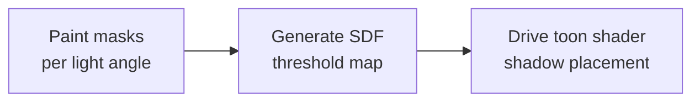

<h1 align="center">QuickSDFTool</h1>

<p align="center">
  Unreal Engine 5 Editor Mode for painting toon-shadow masks and generating SDF threshold maps.
  <br>
  <a href="#demo">Demo</a> · <a href="#quick-start">Quick Start</a> · <a href="#artist-use-cases">Use Cases</a> · <a href="./README_JP.md">日本語</a>
</p>

> [!NOTE]
> **Status: Preview / beta.** QuickSDFTool is usable for experimentation and small production tests, but APIs, UI, and saved asset details may still change before a stable release.

## Demo

QuickSDFTool lets artists paint binary light/shadow masks on a mesh at multiple light angles, then composites those masks into a high-precision SDF threshold texture for toon and cel shading.

https://github.com/user-attachments/assets/1eb770b6-b65d-44bb-b5a0-fbb78d998202

The intended workflow is:



## What Works Today

- Dedicated UE5 Editor Mode named `Quick SDF`.
- Direct painting on Static Mesh and Skeletal Mesh components, including target material-slot isolation.
- 2D UV preview painting with optional UV guides, original-shadow overlay, and onion skinning.
- Angular keyframe timeline with thumbnails, a seek bar/marker, 5-degree snapping, add/duplicate/delete controls, symmetry-aware mask completion, even redistribution, and `DirectionalLight` sync.
- Arrow-key previous/next frame navigation that suppresses viewport movement while the mode handles the keys.
- Paint target modes for Current, All, Before Current, and After Current masks.
- Symmetry mode for front-half sweeps, hold-to-line quick strokes, paint-all-angles style workflows, and 8-mask / 15-mask default completion depending on the sweep range.
- Stabilized brush input with lazy-radius smoothing, pressure-sensitive radius support, antialiased brush edges, and optimized 1K-4K render target painting.
- Mask import from selected textures, file picker, or timeline drag-and-drop; mask export; non-destructive `UQuickSDFAsset` storage; UE transaction-based undo/redo.
- CPU SDF generation with automatic Monopolar/Bipolar packing, optional 1x-8x upscaling, and half-float texture export.
- Example preview/toon materials under `Content/Materials/`.

## Why SDF Threshold Maps?

Regular toon shading often thresholds `N dot L`, which makes shadow borders depend heavily on normals and mesh topology. An SDF threshold map stores artist-painted transition timing in UV space instead. Your shader compares the light direction against the texture value, so the shadow shape can follow a designed anime-style face, hair, or clothing pattern.

Conceptually:

```text
painted light/shadow masks -> SDF interpolation -> RGBA threshold texture -> controlled toon shadow
```

This is especially useful when the "right" shadow is an art-direction decision rather than a physically correct lighting result.

## Artist Use Cases

- **Face shadows:** paint cheek, nose, mouth, and eye-socket shadow shapes that rotate cleanly with the light.
- **Hair shadows:** author simplified shadow bands for bangs and side hair without relying on noisy mesh normals.
- **Clothing shadows:** keep graphic fold shadows stable across stylized materials.
- **Small-team workflows:** iterate in-editor without round-tripping every mask through external tools.

## Quick Start

Use this path when you only want to see a result quickly.

1. Copy this repository into your C++ Unreal project as `Plugins/QuickSDFTool/`.
2. Regenerate project files, build the project, enable **QuickSDFTool**, then restart the editor.
3. Open the Editor Mode selector and choose **Quick SDF**.
4. Select a mesh in the level.
5. Paint white with `LMB`; paint black/shadow with `Shift + LMB`.
6. Add, duplicate, delete, or move timeline keys for the light angles you want.
7. Choose the paint target mode if you want a stroke to affect only the current mask, all masks, or a range before/after the current key.
8. Click **Create Threshold Map** or **Generate SDF Threshold Map** in the tool details.
9. Use the generated texture from `/Game/QuickSDF_GENERATED/` in your toon material.

See [Examples](./Examples/README.md), [Material Setup](./Docs/MaterialSetup.md), and [Troubleshooting](./Docs/Troubleshooting.md) for a fuller walkthrough.

## Installation

QuickSDFTool requires Unreal Engine 5.7 or later and a C++ Unreal project.

1. Clone or download the repository:

   ```bash
   git clone https://github.com/yeczrtu/QuickSDFTool.git
   ```

2. Place it in your project:

   ```text
   YourProject/
   └── Plugins/
       └── QuickSDFTool/
           ├── QuickSDFTool.uplugin
           ├── Source/
           ├── Shaders/
           └── Content/
   ```

3. Regenerate project files and build:

   ```text
   Right-click YourProject.uproject -> Generate Visual Studio project files -> Build
   ```

4. Enable the plugin:

   ```text
   Edit -> Plugins -> Search "QuickSDFTool" -> Enable -> Restart Editor
   ```

## Compatibility

| Unreal Engine version | Status |
| --- | --- |
| 5.7.4 | Tested development target |
| 5.7.x | Supported target |
| 5.8+ | Intended to be supported, but not release-tested yet |
| 5.6 and earlier | Not supported |

QuickSDFTool supports UE 5.7 or later only. The editor tool relies on the Interactive Tools Framework, Modeling Components, Material Baking, and shader module behavior used in UE 5.7 development, so older UE5 releases are outside the supported target range.

## Controls

| Input | Action |
| --- | --- |
| `LMB Drag` | Paint light/white |
| `Shift + LMB Drag` | Paint shadow/black |
| `Ctrl + F`, move mouse, click | Resize brush |
| `Alt + T` | Open the quick toggle menu |
| `Alt + 1` | Cycle paint target mode |
| `Alt + 2` - `Alt + 8` | Toggle Auto Light, Preview, UV overlay, Shadow overlay, Onion Skin, Quick Stroke, and Symmetry |
| `Left / Right Arrow` | Select previous / next timeline frame |
| `Timeline Track Click / Drag` | Seek the light angle and select the nearest key |
| `Timeline Key Click` | Select angle |
| `Timeline Key Drag` | Adjust angle |
| `Timeline Add / Duplicate / Delete` | Create, copy, or remove keyframes |
| `Timeline Seek Bar Click / Drag` | Seek the preview angle and select the nearest timeline key |
| `Timeline 8 or 15 / Even` | Complete the default mask set or redistribute angles evenly. Symmetry mode completes to 8 masks; non-symmetry mode completes to 15 masks |
| `Drag Texture2D assets onto timeline` | Import edited masks |
| `Ctrl + Z / Ctrl + Y` | Undo / Redo |

## Features

- **Custom Editor Mode** — Registers a dedicated UE5 mode accessible from the mode selector toolbar.
- **Direct Mesh Painting** — Paint masks directly on target mesh surfaces with realtime preview and material-slot filtering.
- **2D UV Canvas Painting** — Paint on a HUD-overlaid texture preview for texture-space control.
- **Paint Target Modes** — Send a stroke to the current mask, all masks, or a before/after range on the timeline.
- **Brush Feel Controls** — Lazy-radius stroke stabilization, fine spacing, antialiased brush masks, and pressure-driven brush radius for tablet workflows.
- **Spatial Timeline UI** — Manage mask keyframes by light angle with thumbnail handles, a supported seek bar, add/duplicate/delete actions, snapping, symmetry-aware mask completion, and quick redistribution tools.
- **Preview Light Workflow** — Temporarily mutes scene `DirectionalLight` actors, spawns a preview light, and restores original light intensity on exit/save.
- **Auto Fill from Original Shading** — Bake current viewport/material lighting into masks as a starting point.
- **Mask I/O** — Import edited masks from selected assets, image files, or timeline drops, and export mask textures for external editing.
- **SDF Generation Pipeline** — Generate threshold maps through SDF interpolation, automatic Monopolar/Bipolar RGBA packing, and half-float texture output.
- **Non-Destructive Workflow** — Store work in `UQuickSDFAsset`, optionally save mask textures with the asset, and iterate without losing mask state.

## Roadmap

> [!IMPORTANT]
> The roadmap is ordered by what most improves trust and first-run success for artists trying the plugin.

### P0: Make the Preview Release Reliable

- [ ] Confirm and document the final SDF output direction.
- [ ] Improve or document UV-dependent brush-size mismatch.
- [ ] Add a short end-to-end video showing mask paint -> SDF texture -> toon shader result.
- [ ] Publish `v0.1.0-preview` with release notes and install verification steps.

### P1: Improve Performance and Compatibility

- [ ] Enable the GPU JFA SDF path in the user-facing generation flow.
- [ ] Benchmark 1K, 2K, and 4K mask workflows.
- [ ] Keep UE 5.7+ compatibility notes current as new engine versions are released.

### P2: Deepen Painting Workflow

- [ ] Import custom brush alpha textures.
- [ ] Add richer brush presets and optional custom brush falloff controls.
- [ ] Add explicit previous/next timeline toolbar buttons if keyboard navigation is not enough for artists.
- [ ] Add autosave/hot-reload recovery for unsaved mask changes.

### Planned Feature Requirements

> [!NOTE]
> These are roadmap requirements for future work. They are not available in the current preview build and do not change the current C++ API, `UQuickSDFAsset` format, Slate UI, shortcuts, or asset formats.

#### Monotonic Guard / Clipping Mask

- Add a `Monotonic Guard` paint helper that prevents the same UV pixel from changing state more than once across the active angle range. Sequences such as `black -> white -> black` or `white -> black -> white` should be prevented or reported because they break smooth SDF threshold gradients.
- Support the four expected combinations: increasing angles with white expanding, increasing angles with white shrinking, decreasing angles with white expanding, and decreasing angles with white shrinking.
- Default `Clip Direction` to `Auto`: `0-90` assumes the white area usually expands as the angle increases, while `90-180` uses the opposite direction. Manual overrides should include `White Expands` and `White Shrinks`.
- Integrate with the existing `Current / All / Before / After` paint target modes so clipping only constrains the selected mask range.

#### Quick Nose

- Add `Quick Nose` as a non-destructive vector layer for quickly placing a nose-shadow preset from a single artist-picked nose position.
- Presets should be editable through position, rotation, scale, curve shape, and control points, so the result is a fast starting point rather than a locked final shape.
- Baking should support the current mask or a multi-mask range, be undoable, and preserve the original vector layer for later edits.

#### Quick Reshape

- Treat `Quick Reshape` as a tentative name for a higher-level boundary authoring workflow. Artists draw multiple `Boundary Line` curves on one non-destructive UV-canvas guide layer, then assign each curve to a timeline angle with `Assigned Angle`.
- Each boundary line represents the light/shadow split for its assigned mask. `Bake Matching Angles` should generate or update only the masks whose angles are assigned to boundary lines, not every timeline mask.
- Store boundary lines as editable vector data so their position and curve shape can be refined after baking and baked again later.
- Choose the white/black fill side with `Auto Side` by default, inferred from the angle and line direction, and allow per-line correction with `Invert Side`.
- A valid boundary line should either split the active UV island or form a closed region. Ambiguous partial lines should warn before baking, and fills should stay constrained to the active UV island.
- Keep `Quick Reshape` separate from `Stroke Auto Fill`: `Stroke Auto Fill` is a single-line fill helper, while `Quick Reshape` creates masks from a multi-angle boundary plan.
- Allow `Monotonic Guard` to validate Quick Reshape output during or after baking so repeated `black -> white -> black` or `white -> black -> white` transitions can be caught.

#### Timeline Status Badges

- Extend the existing thumbnail timeline with range highlights for `Current / All / Before / After`.
- Show compact badges per key for mask presence, `Monotonic Guard` enabled state, unbaked vector layers, and warnings.
- Tooltips should expose the angle, texture name, edit state, and warning details for each mask.

#### Mask Freeze

- Add a `Mask Freeze` workflow to reduce VRAM usage by releasing paint render targets for masks that are not actively being edited.
- A frozen mask should keep its authored data as asset-backed mask data or CPU/disk-backed saved texture data, while its transient `PaintRenderTarget` can be discarded until editing or preview requires it again.
- Thawing a mask should recreate its render target from the saved mask data and restore normal paint behavior without changing the mask result.
- Provide actions for freezing the current mask, freezing all inactive masks, thawing the current mask, and thawing all masks.
- Automatically thaw any frozen mask that becomes part of a multi-mask edit, such as `All / Before / After`, bulk fill, Quick Reshape baking, or any future operation that writes to more than the current mask.
- Timeline keys should show frozen/unfrozen state with a badge so artists can tell which masks are immediately editable and which will need to be restored.
- SDF generation, export, save, and overwrite-source workflows must transparently thaw or read frozen masks so output does not silently omit frozen data.
- Undo/Redo should not lose mask data across freeze/thaw operations.

#### Stroke Auto Fill

- Add `Stroke Auto Fill` so a drawn line can preview and fill the chosen left/right side or inside/outside region.
- Support both current-mask edits and bulk application through `All / Before / After`.
- Limit fill operations to the active UV island to avoid accidental fills across unrelated islands.
- Show a preview before committing the fill, and make the committed result undoable.

#### Acceptance Scenarios

- For `0 / 45 / 90` degree masks where white expands, a guarded pixel should transition only once across the range.
- For `90 / 135 / 180` degree masks where white shrinks, the same monotonic guarantee should apply in the reversed growth direction.
- `Quick Nose` should support nose-position picking, preset placement, vector adjustment, baking, and Undo.
- `Quick Reshape` should support multiple boundary lines such as `0 / 30 / 60 / 90` degrees on one guide layer, update only the matching angle masks, keep the guide layer editable after baking, and warn for lines that do not split a UV island or close a region.
- `Mask Freeze` should lower VRAM usage in a high-resolution, multi-mask setup, restore frozen masks without visual changes, and automatically thaw every affected mask before applying multi-mask edits.
- `Stroke Auto Fill` should be verified for current-only edits, `Before / After / All` edits, UV-island isolation, and left/right or inside/outside fill selection.
- The English and Japanese README entries should stay synchronized and clearly marked as planned, not implemented.

## Architecture

```text
QuickSDFTool/
├── Content/
│   ├── Materials/        # Preview and toon materials
│   ├── Textures/         # Default textures
│   └── Widget/           # UMG widget blueprints
├── Shaders/
│   └── Private/
│       └── JumpFloodingCS.usf
└── Source/
    ├── QuickSDFTool/              # Runtime module and UQuickSDFAsset
    ├── QuickSDFToolEditor/        # Editor Mode, paint tool, timeline, processor
    └── QuickSDFToolShaders/       # Compute shader binding
```

| Module | Type | Key Dependencies |
| --- | --- | --- |
| `QuickSDFTool` | Runtime | `Core`, `CoreUObject`, `Engine`, `RenderCore`, `RHI` |
| `QuickSDFToolEditor` | Editor | `InteractiveToolsFramework`, `EditorInteractiveToolsFramework`, `GeometryCore`, `DynamicMesh`, `MeshDescription`, `ModelingComponents`, `MeshConversion`, `EditorSubsystem`, `UMG`, `Slate`, `LevelEditor`, `PropertyEditor`, `MaterialBaking`, `DesktopPlatform`, `ImageWrapper`, `AssetRegistry` |
| `QuickSDFToolShaders` | Runtime / `PostConfigInit` | `Core`, `CoreUObject`, `Engine`, `RenderCore`, `RHI`, `Projects` |

## How It Works

1. **Paint** — For each light angle, paint a binary mask on the mesh or UV preview.
2. **SDF** — Convert each mask to a signed distance field.
3. **Interpolate** — Find transitions between neighboring masks and derive threshold value `T`.
4. **Composite** — Automatically choose Monopolar or Bipolar output and pack values into RGBA channels:
   - **Monopolar:** symmetric shadow behavior, same threshold in RGB.
   - **Bipolar:** asymmetric shadow enter/exit values across RGBA.
5. **Export** — Save the final threshold map as a 16-bit half-float texture.

## Repository Setup Checklist

For maintainers preparing the GitHub page:

- Add these repository topics: `unreal-engine`, `ue5`, `toon-shading`, `cel-shading`, `sdf`, `editor-plugin`, `technical-art`.
- Upload `.github/assets/social-preview.svg` as the GitHub Social Preview image, or export it to PNG first.
- Create a `v0.1.0-preview` release using [the prepared release notes](./Docs/ReleaseNotes/v0.1.0-preview.md).

## Known Defects

- UV layout can affect the relationship between brush size and painted area.
- SDF output direction still needs final verification against the preview material.
- GPU JFA shader files exist, but the public generation path currently uses the CPU `FSDFProcessor` path.

## Contributing

Contributions are welcome. Good first areas are documentation, UE version verification, small workflow fixes, and sample content.

1. Fork the repository.
2. Create a feature branch.
3. Keep changes scoped.
4. Open a pull request with reproduction or verification notes.

## Acknowledgments

- [Unreal Engine Interactive Tools Framework](https://docs.unrealengine.com/5.0/en-US/interactive-tools-framework-in-unreal-engine/) — foundation for the editor paint workflow.
- Felzenszwalb & Huttenlocher — *Distance Transforms of Sampled Functions* (2012).
- Jump Flooding Algorithm (JFA) — GPU distance field generation reference.
- [UE5 SDF Face Shadowマッピングでアニメ顔用の影を作ろう](https://unrealengine.hatenablog.com/entry/2024/02/28/222220).
- [SDF TextureとLiltoonでセルルックの影を再現しよう！](https://note.com/ca__mocha/n/n9289fbbc4c8b).
