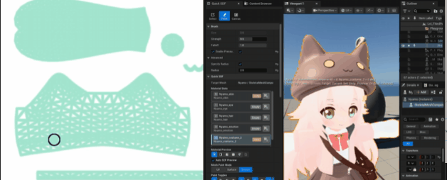
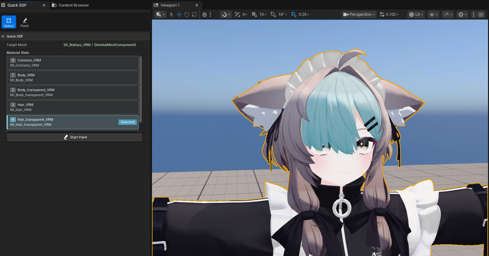
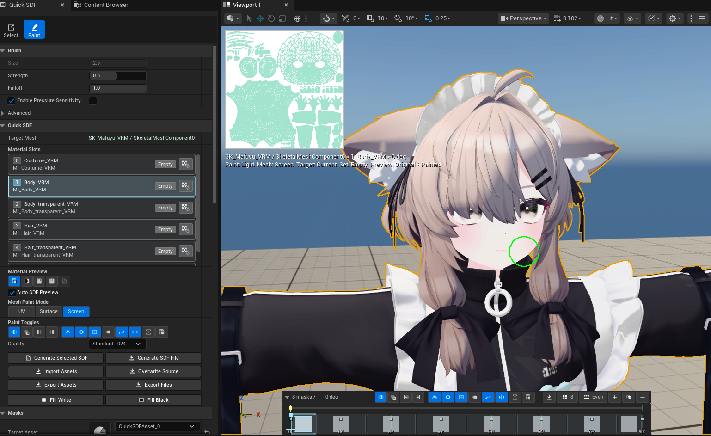
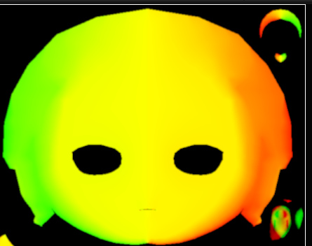

<h1 align="center">QuickSDFTool</h1>

<p align="center">
  Paint anime/toon face shadow masks directly inside Unreal Engine 5,
  then generate SDF threshold maps without leaving the editor.
  <br>
  For artists and technical artists who want controllable anime-style facial shadows in UE5.
  <br>
  <a href="#demo">Demo</a> | <a href="#why-quicksdftool">Why QuickSDFTool?</a> | <a href="#quick-start">Quick Start</a> | <a href="#documentation">Documentation</a> | <a href="./README_JP.md">日本語</a>
</p>

<p align="center">
  <a href="https://github.com/yeczrtu/QuickSDFTool/releases/latest"></a>
  
  
  <a href="https://yeczrtu.github.io/QuickSDFTool/"></a>
  <a href="./LICENSE"></a>
</p>

## Demo

QuickSDFTool brings the face-shadow authoring loop into the UE5 editor: paint masks on the actual character mesh, preview the SDF result, and bake a threshold texture for toon or cel-shading materials.

https://github.com/user-attachments/assets/7eec2890-be31-4cbc-9662-756b6e84c620

<p align="center">
  
</p>

<p align="center">
  Paint masks in UE5 -> preview Live SDF -> generate a threshold texture -> use it in your toon material.
</p>

| Select active slot | Paint in Screen mode | Generated SDF preview |
| --- | --- | --- |
|  |  |  |

Screenshot character model credit: [真冬 Mafuyu / Original 3D Model](https://booth.pm/ja/items/5007531) by ぷらすわん. Character design and 3D modeling: 有坂みと.

## Why QuickSDFTool?

| Workflow | QuickSDFTool | External SDF workflow |
| --- | --- | --- |
| Paint masks directly on a UE mesh | Yes | No |
| Preview on the actual character | Yes | Usually no |
| Material-slot aware painting | Yes | Usually no |
| 2D Canvas and pen-display workflow | Yes | Depends on tool |
| UE undo/redo support | Yes | No |
| Generate SDF threshold texture | Yes | Yes |
| Requires DCC / paint / script roundtrips | No | Often |

## Who is this for?

QuickSDFTool is for technical artists, character artists, and UE5 developers who need controllable anime/toon face shadows without round-tripping masks through DCC tools, 2D paint software, scripts, and Unreal Engine.

Use it when you want to paint shadow masks directly on the character mesh, author multiple light-angle masks, preview them in Unreal Editor, and bake an SDF threshold texture for toon or cel-shading materials.

## Feature Highlights

- Dedicated UE5 Editor Mode named `Quick SDF`.
- Direct painting on Static Mesh and Skeletal Mesh components.
- Material-slot aware painting, slot isolation, and Select-mode active-slot overlay.
- Screen, Surface, and 2D Canvas paint workflows with pen-display input support.
- Live SDF material preview before the final bake.
- CPU SDF threshold texture generation with half-float texture output.

## Quick Start

1. Download the [latest release](https://github.com/yeczrtu/QuickSDFTool/releases/latest).
2. Copy `QuickSDFTool` into `YourProject/Plugins/`.
3. Regenerate project files.
4. Build your C++ Unreal project.
5. Enable **QuickSDFTool** in Plugins, then restart the editor.
6. Open the Editor Mode selector and choose **Quick SDF**.
7. In Select mode, click the mesh/material surface you want to edit, then confirm the active slot in **Material Slots**.
8. Click **Start Paint** and paint white with `LMB` or black/shadow with `Shift + LMB`.
9. Use **2D Canvas** for texture-space strokes, UV guides, onion skin, checker/grid guides, zoom, rotate/flip, or pen-display input.
10. Optionally switch **Material Preview** to **Live SDF**, then use the timeline to add masks and generate the final SDF threshold map.
11. Use the generated texture from `/Game/QuickSDF_GENERATED/` in your toon material.

See [Authoring Workflow](./docs/workflow.md), [Material Setup](./docs/material-setup.md), and [Troubleshooting](./docs/troubleshooting.md) for the full workflow.

## Installation

QuickSDFTool v1.1.0 requires Unreal Engine 5.7.x and a C++ Unreal project.

```bash
git clone https://github.com/yeczrtu/QuickSDFTool.git
```

Place the plugin here:

```text
YourProject/
|-- Plugins/
    |-- QuickSDFTool/
        |-- QuickSDFTool.uplugin
        |-- Source/
        |-- Shaders/
        |-- Content/
```

Then regenerate project files, build the project, enable **QuickSDFTool**, and restart the editor.

## Compatibility

| Unreal Engine version | Status |
| --- | --- |
| 5.7.4 | Required release verification target |
| 5.7.x | Supported target for v1.1.0 |
| 5.8+ | Intended to be supported, but not v1.1.0 release-tested |
| 5.6 and earlier | Not supported |

The v1.1.0 source release targets Unreal Engine 5.7.4 as the required verification version. Rebuild the plugin from source for your exact engine build, especially if you use a source-built, licensee, custom, or otherwise different engine build.

## Documentation

- [Documentation site](./docs/index.md)
- [Authoring Workflow](./docs/workflow.md)
- [Material Setup](./docs/material-setup.md)
- [Troubleshooting](./docs/troubleshooting.md)
- [Release Notes](./docs/release-notes/v1.1.0.md)
- [Roadmap](./docs/roadmap.md)
- [Development Notes](./docs/development.md)
- [日本語 README](./README_JP.md)

## Contributing

Contributions are welcome. Good first areas are documentation, UE version verification, small workflow fixes, and sample content. Keep changes scoped and include reproduction or verification notes in pull requests.

## Acknowledgments

- [Unreal Engine Interactive Tools Framework](https://docs.unrealengine.com/5.0/en-US/interactive-tools-framework-in-unreal-engine/) - foundation for the editor paint workflow.
- Felzenszwalb & Huttenlocher - *Distance Transforms of Sampled Functions* (2012).
- Jump Flooding Algorithm (JFA) - GPU distance field generation reference.
- [UE5 SDF Face Shadow Mappingでアニメ顔用の影を作ろう](https://unrealengine.hatenablog.com/entry/2024/02/28/222220).
- [SDF TextureとLiltoonでセルルックの影を再現しよう](https://note.com/ca__mocha/n/n9289fbbc4c8b).
