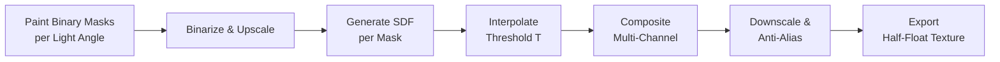

<p align="center">
  <h1 align="center">QuickSDFTool</h1>
  <p align="center">
    An Unreal Engine 5 Editor Mode plugin for creating SDF-based threshold maps for toon/cel shading.
    <br />
    <a href="#features">Features</a> · <a href="#installation">Installation</a> · <a href="#quick-start">Quick Start</a> · <a href="./README_JP.md">日本語</a>
  </p>
</p>

> [!NOTE]
> **Status: Prototype** — This project is under active development. APIs, workflows, and UI may change without notice.

---


https://github.com/user-attachments/assets/1eb770b6-b65d-44bb-b5a0-fbb78d998202


## Overview

**QuickSDFTool** is an editor-only tool that lets artists paint binary shadow masks on 3D meshes at various light angles, then automatically composites them into a high-quality **SDF (Signed Distance Field) threshold map**. The generated texture encodes smooth light-to-shadow transitions in UV space, commonly used in anime/toon rendering to control shadow placement per light direction.

### What Is an SDF Threshold Map?

In toon/cel shading pipelines, an SDF threshold map stores per-texel shadow transition thresholds as a function of light angle. By comparing the dot product of the light direction against the stored threshold, the shader can produce artist-controlled, resolution-independent shadow boundaries — far superior to simple N·L thresholding.

---

## Features

- **Custom Editor Mode** — Registers a dedicated UE5 Editor Mode (`Quick SDF`) accessible from the mode selector toolbar, built on the Interactive Tools Framework
- **Direct Mesh Painting** — Paint binary shadow masks directly on Static Meshes in the viewport with real-time preview using the `BaseBrushTool` pipeline
- **2D UV Canvas Painting** — Paint on a HUD-overlaid 2D texture preview for fine-grained control, with seamless dual-input support (mesh surface ↔ UV canvas)
- **Spatial Timeline UI** — A viewport-overlaid angular timeline widget for managing keyframes by light angle, with:
  - Draggable keyframe handles with thumbnail previews
  - Grid snapping at 5° increments
  - Add / Remove keyframe controls
  - Automatic `DirectionalLight` synchronization
- **Symmetry Mode** — Mirror light angles (0°–90°) to produce symmetric SDF maps, reducing the number of masks needed
- **Onion Skinning** — Semi-transparent overlay of adjacent keyframe textures for smooth transitions between angles
- **Auto Fill from Original Shading** — Bake the current viewport lighting (material baking) into a keyframe as a starting point
- **SDF Generation Pipeline**
  - CPU-side SDF using Felzenszwalb & Huttenlocher distance transform
  - GPU-accelerated Jump Flooding Algorithm (JFA) via Compute Shader
  - Optional super-resolution upscaling (1×–8×) before SDF computation with anti-aliased downscaling
  - Automatic Monopolar / Bipolar format detection
  - Multi-channel output (R/G/B/A) for asymmetric or complex shadow profiles
- **Non-Destructive Workflow** — All paint data is stored in a `UQuickSDFAsset` (Data Asset), which can be saved, reloaded, and iterated upon
- **Full Undo / Redo** — Paint strokes, keyframe edits, and brush resizing are all wrapped in proper UE5 transactions
- **Smooth Brush Input** — Catmull-Rom spline interpolation with configurable stroke stabilization and spacing

---

## Architecture

```
QuickSDFTool/
├── Content/
│   ├── Materials/        # Preview materials (M_PreviewMat)
│   ├── Textures/         # Default texture assets
│   └── Widget/           # UMG widget blueprints
├── Shaders/
│   └── Private/
│       └── JumpFloodingCS.usf   # JFA Compute Shader (SM5+)
└── Source/
    ├── QuickSDFTool/              # Runtime Module
    │   ├── QuickSDFAsset          # UDataAsset for angle data & SDF results
    │   └── QuickSDFToolModule     # Module registration
    ├── QuickSDFToolEditor/        # Editor Module
    │   ├── QuickSDFEditorMode     # UEdMode implementation, light management
    │   ├── QuickSDFPaintTool      # Core paint tool (BaseBrushTool)
    │   ├── QuickSDFSelectTool     # Selection tool for target meshes
    │   ├── QuickSDFToolSubsystem  # Editor subsystem for state management
    │   ├── SDFProcessor           # CPU SDF generation & multi-channel compositing
    │   ├── SQuickSDFTimeline      # Slate viewport overlay timeline widget
    │   └── QuickSDFPreviewWidget  # UMG HUD preview widget
    └── QuickSDFToolShaders/       # Shader Module
        ├── JumpFloodingCS         # Compute shader C++ binding
        └── QuickSDFToolShadersModule
```

### Module Dependencies

| Module | Type | Key Dependencies |
|--------|------|------------------|
| `QuickSDFTool` | Runtime | `Core`, `Engine` |
| `QuickSDFToolEditor` | Editor | `InteractiveToolsFramework`, `EditorInteractiveToolsFramework`, `GeometryCore`, `DynamicMesh`, `ModelingComponents`, `MeshConversion`, `MaterialBaking`, `Slate` |
| `QuickSDFToolShaders` | Runtime (PostConfigInit) | `Core`, `RenderCore`, `RHI` |

---

## Requirements

| Requirement | Version |
|-------------|---------|
| Unreal Engine | 5.7 (Developed on 5.7.4+) |
| Shader Model | SM5 or higher |
| Project Type | C++ project (plugin must be compiled) |

---

## Installation

1. Clone or download this repository:
   ```bash
   git clone https://github.com/YOUR_USERNAME/QuickSDFTool.git
   ```

2. Copy the `QuickSDFTool/` folder into your project's `Plugins/` directory:
   ```
   YourProject/
   └── Plugins/
       └── QuickSDFTool/
           ├── QuickSDFTool.uplugin
           ├── Source/
           ├── Shaders/
           └── Content/
   ```

3. Regenerate project files and build:
   ```bash
   # Windows (Visual Studio)
   Right-click YourProject.uproject → Generate Visual Studio project files → Build
   ```

4. Enable the plugin in the Editor:
   **Edit → Plugins → Search "QuickSDFTool" → Enable → Restart Editor**

---

## Quick Start

1. **Enter the Mode** — Select `Quick SDF` from the Editor Mode dropdown in the viewport toolbar
2. **Select a Mesh** — Click a Static Mesh actor in the scene; it will switch to the SDF preview material
3. **Set Up Keyframes** — Use the timeline overlay at the bottom of the viewport to add/remove keyframes at desired light angles
4. **Paint Shadows** — LMB to paint light (white), Shift+LMB to paint shadow (black) on the mesh or the 2D UV preview
5. **Navigate Angles** — Click keyframes in the timeline to switch angles; the preview light rotates to match
6. **Generate SDF** — Click **"Generate SDF Threshold Map"** in the Details panel to run the compositing pipeline
7. **Export** — The final texture is saved to `/Game/QuickSDF_GENERATED/`

### Controls

| Input | Action |
|-------|--------|
| LMB Drag | Paint light (white) |
| Shift + LMB Drag | Paint shadow (black) |
| Ctrl + F + Mouse Move | Resize brush |
| Timeline Keyframe Click | Select angle |
| Timeline Keyframe Drag | Adjust angle |
| Ctrl + Z / Ctrl + Y | Undo / Redo |

---

## TODO

> [!IMPORTANT]
> This is a prototype. The following items are planned or under consideration:

- [ ] **GPU-Accelerated SDF** — Migrate SDF generation from CPU (Felzenszwalb) to fully GPU-based using the existing JFA compute shader
- [ ] **Skeletal Mesh Support** — Extend paint target support beyond Static Meshes
- [ ] **Custom Brush Shapes** — Support for importing custom brush alpha textures
- [ ] **Pressure Sensitivity** — Tablet pressure support for brush opacity/size
- [ ] **Auto-Save / Hot-Reload** — Periodic checkpoint saves for paint data
- [ ] **Multi-UV Channel Preview** — Simultaneous visualization of different UV layouts
- [ ] **Documentation & Tutorials** — Video walkthroughs and detailed wiki
- [ ] **Performance Profiling** — Benchmark and optimize for high-resolution textures (4K+)
- [ ] **Icon & Branding** — Custom editor mode icon and plugin branding assets
- [ ] Frame duplication function
- [ ] A feature that places images at equal intervals on the timeline.
- [ ] Buttons and shortcuts to move to the next frame on the timeline.
- [ ] Function to import existing textures.
- [ ] Creating social previews for GitHub.


### Known defects

- The UI disappears when autosave activates.
- Depending on how the UV map is unwrapped, the brush size and the area being painted may be misaligned in the paint program.
- Sometimes, when you click on an image in the timeline, it can become misaligned.
- Unable to specify a name when exporting an image / Unable to overwrite a file with the same name.
- The direction of SDF is reversed.

---

## How It Works



1. **Paint** — For each light angle, paint a binary shadow mask on the mesh  
2. **SDF** — Each mask is converted to a signed distance field using the Felzenszwalb & Huttenlocher algorithm  
3. **Interpolation** — The boundary between adjacent masks is located via SDF zero-crossing interpolation, yielding a per-texel threshold value *T* (0–1)  
4. **Compositing** — Threshold values are packed into RGBA channels:
   - **Monopolar** (symmetric): All channels store the same threshold
   - **Bipolar** (asymmetric): R = shadow-enter (0°–90°), B = shadow-exit (0°–90°), G = shadow-enter (90°–180°), A = shadow-exit (90°–180°)
5. **Export** — Final texture is exported as a 16-bit half-float texture for precision

---

## Contributing

Contributions are welcome! Please:

1. Fork the repository
2. Create a feature branch (`git checkout -b feature/amazing-feature`)
3. Commit your changes (`git commit -m 'Add amazing feature'`)
4. Push to the branch (`git push origin feature/amazing-feature`)
5. Open a Pull Request


---

## Acknowledgments

- [Unreal Engine Interactive Tools Framework](https://docs.unrealengine.com/5.0/en-US/interactive-tools-framework-in-unreal-engine/) — Foundation for the paint tool
- Felzenszwalb & Huttenlocher — *Distance Transforms of Sampled Functions* (2012) — SDF algorithm
- Jump Flooding Algorithm (JFA) — GPU-accelerated distance field computation
- [UE5 SDF Face Shadowマッピングでアニメ顔用の影を作ろう](https://unrealengine.hatenablog.com/entry/2024/02/28/222220)
