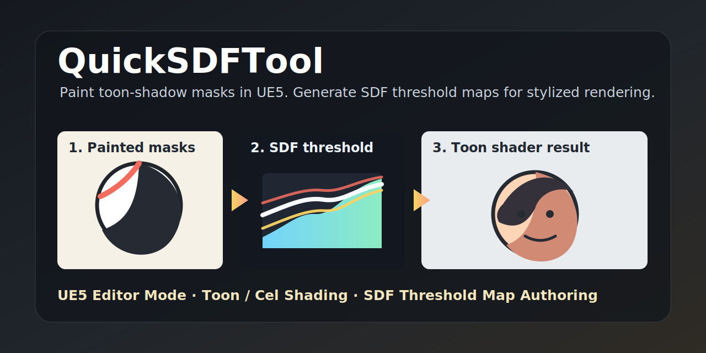
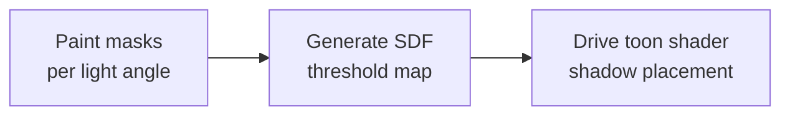

<p align="center">
  
</p>

<h1 align="center">QuickSDFTool</h1>

<p align="center">
  Unreal Engine 5 Editor Mode for painting toon-shadow masks and generating SDF threshold maps.
  <br>
  <a href="#demo">Demo</a> · <a href="#quick-start">Quick Start</a> · <a href="#artist-use-cases">Use Cases</a> · <a href="./README_JP.md">日本語</a>
</p>

> [!NOTE]
> **Status: Prototype.** QuickSDFTool is usable for experimentation and small production tests, but APIs, UI, and saved asset details may still change before a stable release.

## Demo

QuickSDFTool lets artists paint binary light/shadow masks on a mesh at multiple light angles, then composites those masks into a high-precision SDF threshold texture for toon and cel shading.

https://github.com/user-attachments/assets/1eb770b6-b65d-44bb-b5a0-fbb78d998202

The intended workflow is:



## What Works Today

- Dedicated UE5 Editor Mode named `Quick SDF`.
- Direct painting on Static Mesh and Skeletal Mesh components.
- 2D UV preview painting for precise texture-space edits.
- Angular keyframe timeline with thumbnails, snapping, add/remove controls, and `DirectionalLight` sync.
- Symmetry mode for front-half sweeps, onion skinning, quick strokes, and paint-all-angles workflow.
- Mask import/export, non-destructive `UQuickSDFAsset` storage, and UE transaction-based undo/redo.
- CPU SDF generation with optional 1x-8x upscaling and half-float texture export.
- Example preview/toon materials under `Content/Materials/`.

## Why SDF Threshold Maps?

Regular toon shading often thresholds `N dot L`, which makes shadow borders depend heavily on normals and mesh topology. An SDF threshold map stores artist-painted transition timing in UV space instead. Your shader compares the light direction against the texture value, so the shadow shape can follow a designed anime-style face, hair, or clothing pattern.

Conceptually:

```text
painted light/shadow masks -> SDF interpolation -> RGBA threshold texture -> controlled toon shadow
```

This is especially useful when the "right" shadow is an art-direction decision rather than a physically correct lighting result.

## Artist Use Cases

- **Face shadows:** paint cheek, nose, mouth, and eye-socket shadow shapes that rotate cleanly with the light.
- **Hair shadows:** author simplified shadow bands for bangs and side hair without relying on noisy mesh normals.
- **Clothing shadows:** keep graphic fold shadows stable across stylized materials.
- **Small-team workflows:** iterate in-editor without round-tripping every mask through external tools.

## Quick Start

Use this path when you only want to see a result quickly.

1. Copy this repository into your C++ Unreal project as `Plugins/QuickSDFTool/`.
2. Regenerate project files, build the project, enable **QuickSDFTool**, then restart the editor.
3. Open the Editor Mode selector and choose **Quick SDF**.
4. Select a mesh in the level.
5. Paint white with `LMB`; paint black/shadow with `Shift + LMB`.
6. Add or move timeline keys for the light angles you want.
7. Click **Create Threshold Map** or **Generate SDF Threshold Map** in the tool details.
8. Use the generated texture from `/Game/QuickSDF_GENERATED/` in your toon material.

See [Examples](./Examples/README.md), [Material Setup](./Docs/MaterialSetup.md), and [Troubleshooting](./Docs/Troubleshooting.md) for a fuller walkthrough.

## Installation

1. Clone or download the repository:

   ```bash
   git clone https://github.com/yeczrtu/QuickSDFTool.git
   ```

2. Place it in your project:

   ```text
   YourProject/
   └── Plugins/
       └── QuickSDFTool/
           ├── QuickSDFTool.uplugin
           ├── Source/
           ├── Shaders/
           └── Content/
   ```

3. Regenerate project files and build:

   ```text
   Right-click YourProject.uproject -> Generate Visual Studio project files -> Build
   ```

4. Enable the plugin:

   ```text
   Edit -> Plugins -> Search "QuickSDFTool" -> Enable -> Restart Editor
   ```

## Compatibility

| Unreal Engine version | Status |
| --- | --- |
| 5.7.4 | Tested development target |
| 5.7.x | Expected to work, not fully release-tested |
| 5.6 | Not tested |
| 5.5 | Not tested |
| 5.4 | Not tested |

QuickSDFTool currently targets UE 5.7 because the editor tool is built on current Interactive Tools Framework, Modeling Components, Material Baking, and shader module behavior used during development. Compatibility with earlier UE5 releases may be possible, but it has not been verified yet.

## Controls

| Input | Action |
| --- | --- |
| `LMB Drag` | Paint light/white |
| `Shift + LMB Drag` | Paint shadow/black |
| `Ctrl + F + Mouse Move` | Resize brush |
| `Timeline Key Click` | Select angle |
| `Timeline Key Drag` | Adjust angle |
| `Ctrl + Z / Ctrl + Y` | Undo / Redo |

## Features

- **Custom Editor Mode** — Registers a dedicated UE5 mode accessible from the mode selector toolbar.
- **Direct Mesh Painting** — Paint masks directly on target mesh surfaces with realtime preview.
- **2D UV Canvas Painting** — Paint on a HUD-overlaid texture preview for texture-space control.
- **Spatial Timeline UI** — Manage mask keyframes by light angle with thumbnail handles.
- **Auto Fill from Original Shading** — Bake current viewport/material lighting into a keyframe as a starting point.
- **SDF Generation Pipeline** — Generate threshold maps through SDF interpolation and RGBA channel packing.
- **Non-Destructive Workflow** — Store work in `UQuickSDFAsset` and iterate without losing mask state.

## Roadmap

> [!IMPORTANT]
> The roadmap is ordered by what most improves trust and first-run success for artists trying the plugin.

### P0: Make the Preview Release Reliable

- [ ] Confirm and document the final SDF output direction.
- [ ] Fix timeline thumbnail/handle misalignment after clicking.
- [ ] Improve or document UV-dependent brush-size mismatch.
- [ ] Add a short end-to-end video showing mask paint -> SDF texture -> toon shader result.
- [ ] Publish `v0.1.0-preview` with release notes and install verification steps.

### P1: Improve Performance and Compatibility

- [ ] Enable the GPU JFA SDF path in the user-facing generation flow.
- [ ] Benchmark 1K, 2K, and 4K mask workflows.
- [ ] Verify UE 5.6, 5.5, and 5.4 compatibility or document required changes.

### P2: Deepen Painting Workflow

- [ ] Import custom brush alpha textures.
- [ ] Add tablet pressure support for brush size and opacity.
- [ ] Duplicate the current timeline frame and mask data.
- [ ] Add previous/next timeline navigation buttons and shortcuts.
- [ ] Add autosave/hot-reload recovery for unsaved mask changes.

## Architecture

```text
QuickSDFTool/
├── Content/
│   ├── Materials/        # Preview and toon materials
│   ├── Textures/         # Default textures
│   └── Widget/           # UMG widget blueprints
├── Shaders/
│   └── Private/
│       └── JumpFloodingCS.usf
└── Source/
    ├── QuickSDFTool/              # Runtime module and UQuickSDFAsset
    ├── QuickSDFToolEditor/        # Editor Mode, paint tool, timeline, processor
    └── QuickSDFToolShaders/       # Compute shader binding
```

| Module | Type | Key Dependencies |
| --- | --- | --- |
| `QuickSDFTool` | Runtime | `Core`, `Engine` |
| `QuickSDFToolEditor` | Editor | `InteractiveToolsFramework`, `EditorInteractiveToolsFramework`, `GeometryCore`, `DynamicMesh`, `ModelingComponents`, `MeshConversion`, `MaterialBaking`, `Slate` |
| `QuickSDFToolShaders` | Runtime / `PostConfigInit` | `Core`, `RenderCore`, `RHI` |

## How It Works

1. **Paint** — For each light angle, paint a binary mask on the mesh or UV preview.
2. **SDF** — Convert each mask to a signed distance field.
3. **Interpolate** — Find transitions between neighboring masks and derive threshold value `T`.
4. **Composite** — Pack values into RGBA channels:
   - **Monopolar:** symmetric shadow behavior, same threshold in RGB.
   - **Bipolar:** asymmetric shadow enter/exit values across RGBA.
5. **Export** — Save the final threshold map as a 16-bit half-float texture.

## Repository Setup Checklist

For maintainers preparing the GitHub page:

- Add these repository topics: `unreal-engine`, `ue5`, `toon-shading`, `cel-shading`, `sdf`, `editor-plugin`, `technical-art`.
- Upload `.github/assets/social-preview.svg` as the GitHub Social Preview image, or export it to PNG first.
- Create a `v0.1.0-preview` release using [the prepared release notes](./Docs/ReleaseNotes/v0.1.0-preview.md).

## Known Defects

- UV layout can affect the relationship between brush size and painted area.
- Timeline thumbnails/handles can become misaligned after interaction.
- SDF output direction still needs final verification against the preview material.
- GPU JFA shader files exist, but the public generation path currently uses the CPU `FSDFProcessor` path.

## Contributing

Contributions are welcome. Good first areas are documentation, UE version verification, small workflow fixes, and sample content.

1. Fork the repository.
2. Create a feature branch.
3. Keep changes scoped.
4. Open a pull request with reproduction or verification notes.

## Acknowledgments

- [Unreal Engine Interactive Tools Framework](https://docs.unrealengine.com/5.0/en-US/interactive-tools-framework-in-unreal-engine/) — foundation for the editor paint workflow.
- Felzenszwalb & Huttenlocher — *Distance Transforms of Sampled Functions* (2012).
- Jump Flooding Algorithm (JFA) — GPU distance field generation reference.
- [UE5 SDF Face Shadow Mapping article](https://unrealengine.hatenablog.com/entry/2024/02/28/222220).
- [SDF Texture and LilToon note](https://note.com/ca__mocha/n/n9289fbbc4c8b).
