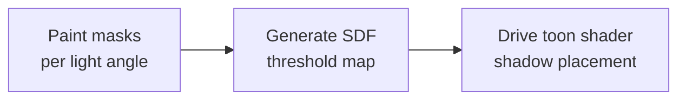

<h1 align="center">QuickSDFTool</h1>

<p align="center">
  Unreal Engine 5 Editor Mode for painting toon-shadow masks and generating SDF threshold maps.
  <br>
  <a href="#demo">Demo</a> | <a href="#quick-start">Quick Start</a> | <a href="#artist-use-cases">Use Cases</a> | <a href="./README_JP.md">日本語</a>
</p>

> [!NOTE]
> **Status: Preview / beta.** QuickSDFTool is usable for experimentation and small production tests, but APIs, UI, and saved asset details may still change before a stable release.

## Demo

QuickSDFTool lets artists paint binary light/shadow masks on a mesh at multiple light angles, then composites those masks into a high-precision SDF threshold texture for toon and cel shading.

https://github.com/user-attachments/assets/1eb770b6-b65d-44bb-b5a0-fbb78d998202

The intended workflow is:



## What Works Today

- Dedicated UE5 Editor Mode named `Quick SDF`.
- Direct painting on Static Mesh and Skeletal Mesh components, including target material-slot isolation.
- Compact `Material Slots` list with row-click selection, `Baked` / `Empty` status pills, and per-slot Bake actions. Bulk multi-slot bake buttons are intentionally not part of the main workflow.
- 2D UV preview painting with optional UV guides, original-shadow overlay, and onion skinning.
- Angular timeline with a separated upper seek lane and lower keyframe lane, thumbnail previews, high-contrast angle labels, 5-degree snapping, add/duplicate/delete controls, symmetry-aware mask completion, even redistribution, and `DirectionalLight` sync.
- Timeline status badges and paint-target range highlights for `Current`, `All`, `Before`, and `After`, including mask, `Monotonic Guard`, and warning indicators plus detailed tooltips.
- Arrow-key previous/next frame navigation that suppresses viewport movement while the mode handles the keys.
- Paint target modes for Current, All, Before Current, and After Current masks.
- Symmetry mode for front-half sweeps, hold-to-line quick strokes, paint-all-angles style workflows, and 8-mask / 15-mask default completion depending on the sweep range.
- Monotonic Guard for silently clipping paint strokes that would introduce repeated light/shadow flips across mask angles, with validation warnings before SDF generation.
- Stabilized brush input with lazy-radius smoothing, pressure-sensitive radius support, antialiased brush edges, and optimized 1K-4K render target painting.
- Mask import from file picker or timeline drag-and-drop; mask export; non-destructive `UQuickSDFAsset` storage; UE transaction-based undo/redo.
- CPU SDF generation with automatic Monopolar/Bipolar packing, optional 1x-8x upscaling, and half-float texture export.
- Example preview/toon materials under `Content/Materials/`.

## Why SDF Threshold Maps?

Regular toon shading often thresholds `N dot L`, which makes shadow borders depend heavily on normals and mesh topology. An SDF threshold map stores artist-painted transition timing in UV space instead. Your shader compares the light direction against the texture value, so the shadow shape can follow a designed anime-style face, hair, or clothing pattern.

Conceptually:

```text
painted light/shadow masks -> SDF interpolation -> RGBA threshold texture -> controlled toon shadow
```

This is especially useful when the "right" shadow is an art-direction decision rather than a physically correct lighting result.

## Artist Use Cases

- **Face shadows:** paint cheek, nose, mouth, and eye-socket shadow shapes that rotate cleanly with the light.
- **Hair shadows:** author simplified shadow bands for bangs and side hair without relying on noisy mesh normals.
- **Clothing shadows:** keep graphic fold shadows stable across stylized materials.
- **Small-team workflows:** iterate in-editor without round-tripping every mask through external tools.

## Quick Start

Use this path when you only want to see a result quickly.

1. Copy this repository into your C++ Unreal project as `Plugins/QuickSDFTool/`.
2. Regenerate project files, build the project, enable **QuickSDFTool**, then restart the editor.
3. Open the Editor Mode selector and choose **Quick SDF**.
4. Select a mesh in the level.
5. In **Material Slots**, click the row you want to edit. Use the small Bake icon on that row if the slot still needs a baked source mask.
6. Paint white with `LMB`; paint black/shadow with `Shift + LMB`.
7. Use the upper timeline lane to seek the light angle. Use the lower keyframe lane to select, add, duplicate, delete, or drag keyframes.
8. Choose the paint target mode if you want a stroke to affect only the current mask, all masks, or a range before/after the current key. The highlighted timeline range shows what will be edited.
9. Click **Generate Selected SDF** or **Generate SDF Threshold Map** in the tool details.
10. Use the generated texture from `/Game/QuickSDF_GENERATED/` in your toon material.

See [Examples](./Examples/README.md), [Material Setup](./Docs/MaterialSetup.md), and [Troubleshooting](./Docs/Troubleshooting.md) for a fuller walkthrough.

## Installation

QuickSDFTool requires Unreal Engine 5.7 or later and a C++ Unreal project.

1. Clone or download the repository:

   ```bash
   git clone https://github.com/yeczrtu/QuickSDFTool.git
   ```

2. Place it in your project:

   ```text
   YourProject/
   |-- Plugins/
       |-- QuickSDFTool/
           |-- QuickSDFTool.uplugin
           |-- Source/
           |-- Shaders/
           |-- Content/
   ```

3. Regenerate project files and build:

   ```text
   Right-click YourProject.uproject -> Generate Visual Studio project files -> Build
   ```

4. Enable the plugin:

   ```text
   Edit -> Plugins -> Search "QuickSDFTool" -> Enable -> Restart Editor
   ```

## Compatibility

| Unreal Engine version | Status |
| --- | --- |
| 5.7.4 | Tested development target |
| 5.7.x | Supported target |
| 5.8+ | Intended to be supported, but not release-tested yet |
| 5.6 and earlier | Not supported |

QuickSDFTool supports UE 5.7 or later only. The editor tool relies on the Interactive Tools Framework, Modeling Components, Material Baking, and shader module behavior used in UE 5.7 development, so older UE5 releases are outside the supported target range.

## Controls

| Input | Action |
| --- | --- |
| `LMB Drag` | Paint light/white |
| `Shift + LMB Drag` | Paint shadow/black |
| `Ctrl + F`, move mouse, click | Resize brush while the mouse is over the viewport |
| `Alt + T` | Open the quick toggle menu |
| `Alt + 1` | Cycle paint target mode |
| `Alt + 2` - `Alt + 9` | Toggle Auto Light, Preview, UV overlay, Shadow overlay, Onion Skin, Quick Stroke, Symmetry, and Monotonic Guard |
| `Left / Right Arrow` | Select previous / next timeline frame |
| `Material Slot Row Click` | Select the material slot / texture set to edit |
| `Material Slot Bake Icon` | Bake that slot only |
| `Timeline Seek Lane Click / Drag` | Seek the preview light angle without dragging keyframes |
| `Timeline Key Click` | Select angle |
| `Timeline Key Drag` | Adjust angle after the drag threshold is crossed |
| `Timeline Status Badge Hover` | Inspect angle, texture, edit state, paint target inclusion, Guard state, overwrite state, and warning details |
| `Timeline Add / Duplicate / Delete` | Create, copy, or remove keyframes |
| `Timeline 8 or 15 / Even` | Complete the default mask set or redistribute angles evenly. Symmetry mode completes to 8 masks; non-symmetry mode completes to 15 masks |
| `Drag Texture2D assets onto timeline` | Import edited masks |
| `Ctrl + Z / Ctrl + Y` | Undo / Redo |

## Features

- **Custom Editor Mode:** registers a dedicated UE5 mode accessible from the mode selector toolbar.
- **Direct Mesh Painting:** paint masks directly on target mesh surfaces with realtime preview and material-slot filtering.
- **Material Slot Workflow:** select a slot by clicking its row, read compact `Baked` / `Empty` state pills, and bake only the active slot from the row action. Multi-slot bulk bake controls are omitted from the standard workflow because most toon-mask edits are slot-specific.
- **2D UV Canvas Painting:** paint on a HUD-overlaid texture preview for texture-space control.
- **Paint Target Modes:** send a stroke to the current mask, all masks, or a before/after range on the timeline. The timeline range highlight uses the same midpoint-based key segments as the edit operation.
- **Timeline Status Badges:** each key can show mask availability, active Guard state, and warning state without blocking keyframe interaction. Tooltips expose the texture name or `Missing`, paint-target inclusion, overwrite status, and warning message.
- **Monotonic Guard / Clipping Mask:** when enabled, normal brush strokes and Quick Stroke are clipped at commit time so the same UV pixel does not flip repeatedly across mask angles. Current-mask strokes are checked against the surrounding processable mask set, but only pixels changed by the stroke are restored. Import, rebake, and SDF generation do not auto-fix masks; they only report validation warnings.
- **Brush Feel Controls:** lazy-radius stroke stabilization, fine spacing, antialiased brush masks, and pressure-driven brush radius for tablet workflows.
- **Spatial Timeline UI:** manage mask keyframes by light angle with separate seek/keyframe lanes, clearer thumbnail segmentation, status badges, add/duplicate/delete actions, snapping, symmetry-aware mask completion, and quick redistribution tools.
- **Preview Light Workflow:** temporarily mutes scene `DirectionalLight` actors, spawns a preview light, and restores original light intensity on exit/save.
- **Auto Fill from Original Shading:** bake current viewport/material lighting into masks as a starting point.
- **Mask I/O:** import edited masks from image files or timeline drops, and export mask textures for external editing.
- **SDF Generation Pipeline:** generate threshold maps through SDF interpolation, automatic Monopolar/Bipolar RGBA packing, and half-float texture output.
- **Non-Destructive Workflow:** store work in `UQuickSDFAsset`, optionally save mask textures with the asset, and iterate without losing mask state.

## Material Slots

The `Quick SDF > Material Slots` section is designed for the common case where artists edit one material slot at a time.

- Clicking a row selects the corresponding texture set and updates the active paint/bake target.
- Each row shows the slot number, slot name, material name, and a compact status pill such as `Baked` or `Empty`.
- The row action button bakes only that slot. The old `Bake Selected`, `Bake Missing`, and `Generate All` style bulk actions are intentionally left out of the primary UI.
- Active rows use a subtle accent, brighter background, and border so the editable slot remains visible in dense Details Panel layouts.
- Long slot lists are contained in a scrollable area to avoid pushing the rest of the tool UI off screen.

## Timeline

The timeline is split into two interaction lanes to reduce accidental edits.

- The upper seek lane is the only area that seeks the preview angle by click or drag. It shows the current light/seek cursor and degree ticks.
- The lower keyframe lane contains thumbnails and key handles. Keyframes select on click and move only after the drag threshold is crossed.
- Thumbnail backgrounds do not handle input; keyframe widgets own selection and drag behavior.
- Paint-target range highlights are always shown for `Current`, `All`, `Before`, and `After`. The visible range is calculated from neighboring-angle midpoints so the highlight matches the masks that will be edited.
- Key status badges are hit-test invisible and do not interfere with selecting, dragging, importing, or seeking.
- The current vector-layer badge exists internally as a hidden placeholder for future Quick Nose / Quick Reshape work.

## Monotonic Guard

`Monotonic Guard` is an optional paint-time safety check for SDF threshold masks. It treats `R >= 127` as white and lower values as black, then prevents a pixel from creating repeated transitions such as `black -> white -> black` or `white -> black -> white` across the processable angle sequence.

- The quick toggle is labeled `Guard`; the shortcut is `Alt + 9`.
- `Clip Direction` defaults to `Auto`: `0-90` degrees uses `White Expands`, and `90-180` degrees uses `White Shrinks`. Manual overrides are available as `White Expands` and `White Shrinks`.
- Normal brush strokes and Quick Stroke are clipped silently before the undo transaction is finalized. The user action is not blocked and no notification is shown while painting.
- Soft antialiased stroke edges are handled as stroke intent: a pixel that becomes brighter is treated as a white stroke for guard evaluation, and a pixel that becomes darker is treated as a black stroke, even if it does not cross the `127` binary threshold.
- `Current / All / Before / After` still decide which masks receive the stroke. The guard evaluates the relevant processable mask sequence and restores only the pixels changed by the current stroke.
- Imported masks, rebaked masks, and SDF generation are not automatically modified. Use the `Validate Monotonic Guard` action, or run SDF generation with the guard enabled, to get warnings about existing violations.

## Roadmap

> [!IMPORTANT]
> The roadmap is ordered by what most improves trust and first-run success for artists trying the plugin.

### P0: Make the Preview Release Reliable

- [ ] Confirm and document the final SDF output direction.
- [ ] Improve or document UV-dependent brush-size mismatch.
- [ ] Add a short end-to-end video showing mask paint -> SDF texture -> toon shader result.
- [ ] Publish preview releases with release notes and install verification steps.

### P1: Improve Performance and Compatibility

- [ ] Enable the GPU JFA SDF path in the user-facing generation flow.
- [ ] Benchmark 1K, 2K, and 4K mask workflows.
- [ ] Keep UE 5.7+ compatibility notes current as new engine versions are released.

### P2: Deepen Painting Workflow

- [ ] Import custom brush alpha textures.
- [ ] Add richer brush presets and optional custom brush falloff controls.
- [ ] Add explicit previous/next timeline toolbar buttons if keyboard navigation is not enough for artists.
- [ ] Add autosave/hot-reload recovery for unsaved mask changes.

### Planned Feature Requirements

> [!NOTE]
> These are roadmap requirements for future work. They are not available in the current preview build and do not change the current C++ API, `UQuickSDFAsset` format, Slate UI, shortcuts, or asset formats unless a future release explicitly says so.

#### Quick Nose

- Add `Quick Nose` as a non-destructive vector layer for quickly placing a nose-shadow preset from a single artist-picked nose position.
- Presets should be editable through position, rotation, scale, curve shape, and control points, so the result is a fast starting point rather than a locked final shape.
- Baking should support the current mask or a multi-mask range, be undoable, and preserve the original vector layer for later edits.

#### Quick Reshape

- Treat `Quick Reshape` as a tentative name for a higher-level boundary authoring workflow. Artists draw multiple `Boundary Line` curves on one non-destructive UV-canvas guide layer, then assign each curve to a timeline angle with `Assigned Angle`.
- Each boundary line represents the light/shadow split for its assigned mask. `Bake Matching Angles` should generate or update only the masks whose angles are assigned to boundary lines, not every timeline mask.
- Store boundary lines as editable vector data so their position and curve shape can be refined after baking and baked again later.
- Choose the white/black fill side with `Auto Side` by default, inferred from the angle and line direction, and allow per-line correction with `Invert Side`.
- A valid boundary line should either split the active UV island or form a closed region. Ambiguous partial lines should warn before baking, and fills should stay constrained to the active UV island.
- Keep `Quick Reshape` separate from `Stroke Auto Fill`: `Stroke Auto Fill` is a single-line fill helper, while `Quick Reshape` creates masks from a multi-angle boundary plan.
- Allow `Monotonic Guard` to validate Quick Reshape output during or after baking so repeated `black -> white -> black` or `white -> black -> white` transitions can be caught.

#### Brush Projection Mode

- Add a streamlined `Brush Projection Mode` option for artists who want to paint by final screen-space appearance instead of only by the current surface/UV-based behavior.
- Keep the first version intentionally small: `Surface / UV` preserves the current precise texture-space workflow, while `View Projected` shows the brush shape in screen space and projects that footprint onto visible mesh surfaces.
- `View Projected` should feel similar to Blender/Substance-style camera-projected painting for quick face-shadow shape design, especially when artists care more about the visible silhouette than the UV-space brush footprint.
- Avoid exposing a large matrix of projection, alignment, and size-space options at first; the goal is a quick mode switch, not a full texture-paint system.
- The projected brush should affect visible hit surfaces by default and avoid painting through the model with backface and occlusion protection.
- Existing brush controls such as radius, falloff, antialiasing, pressure radius, quick stroke, and paint target modes should work where practical in both projection modes.
- The viewport cursor should clearly indicate the active projection mode because the same stroke may produce different UV results depending on the mode.

#### Actor Mesh Component Selection

- Address the current limitation where a single actor that owns multiple mesh components does not provide a clear way to choose which mesh should be edited by QuickSDFTool.
- Add a component-level target picker for eligible `StaticMeshComponent` and `SkeletalMeshComponent` instances inside the selected actor.
- The picker should show enough context to identify each target, such as component name, mesh asset name, material slots, and visibility state.
- Painting, mask import, mask export, baking, SDF generation, and material-slot isolation should apply only to the selected mesh component, not every mesh on the actor.
- Switching between mesh components should preserve each component's QuickSDF asset/mask state so artists can work on face, hair, clothing, or accessory meshes separately inside one actor.
- If viewport picking is supported, clicking a surface on a multi-mesh actor should resolve to the hit mesh component when possible and fall back to the component picker when ambiguous.

#### Material Slot Isolation and Bake Scope

- The current UI already supports row-click material-slot selection and per-slot baking. Future work should focus on advanced edit-scope behavior instead of reintroducing broad bulk-bake controls.
- Fix material-slot isolation so hidden non-target slots do not keep blocking paint hits. When artists isolate one slot or body part, paint picking and brush projection should ignore collision or hit results from the slots that are not visible/editable.
- Treat the isolate state as an edit target filter, not only as a viewport visibility filter, so artists can reliably paint the currently selected slot even when the full mesh still has geometry under the cursor.
- Add optional advanced bake-scope controls for meshes whose slots have separated UV layouts, so artists can choose exactly which slots need baking, skip unused slots, and understand the cost before starting a bake.
- Preserve separate bake outputs or warnings per slot when UV islands/material slots do not share a useful combined layout.

#### Threshold Map Reverse Conversion

- Add a reverse-conversion workflow that can reconstruct or preview an angle-specific mask from a completed threshold map by entering a target light angle.
- The reverse conversion should support at least preview, extraction to the current mask, and extraction to a new mask so artists can inspect or repair completed threshold maps.
- Clarify how Monopolar and Bipolar threshold maps are interpreted during reverse conversion, including which channel or value pair is used for the requested angle.

#### Mask Freeze

- Add a `Mask Freeze` workflow to reduce VRAM usage by releasing paint render targets for masks that are not actively being edited.
- A frozen mask should keep its authored data as asset-backed mask data or CPU/disk-backed saved texture data, while its transient `PaintRenderTarget` can be discarded until editing or preview requires it again.
- Thawing a mask should recreate its render target from the saved mask data and restore normal paint behavior without changing the mask result.
- Provide actions for freezing the current mask, freezing all inactive masks, thawing the current mask, and thawing all masks.
- Automatically thaw any frozen mask that becomes part of a multi-mask edit, such as `All / Before / After`, bulk fill, Quick Reshape baking, or any future operation that writes to more than the current mask.
- Timeline keys should show frozen/unfrozen state with a badge so artists can tell which masks are immediately editable and which will need to be restored.
- SDF generation, export, save, and overwrite-source workflows must transparently thaw or read frozen masks so output does not silently omit frozen data.
- Undo/Redo should not lose mask data across freeze/thaw operations.

#### Stroke Auto Fill

- Add `Stroke Auto Fill` so a drawn line can preview and fill the chosen left/right side or inside/outside region.
- Support both current-mask edits and bulk application through `All / Before / After`.
- Limit fill operations to the active UV island to avoid accidental fills across unrelated islands.
- Show a preview before committing the fill, and make the committed result undoable.

#### Acceptance Scenarios

- `Quick Nose` should support nose-position picking, preset placement, vector adjustment, baking, and Undo.
- `Quick Reshape` should support multiple boundary lines such as `0 / 30 / 60 / 90` degrees on one guide layer, update only the matching angle masks, keep the guide layer editable after baking, and warn for lines that do not split a UV island or close a region.
- `Brush Projection Mode` should let artists switch between the current `Surface / UV` behavior and a `View Projected` brush, preserve the visible brush shape in screen space, and avoid painting hidden or back-facing surfaces.
- `Actor Mesh Component Selection` should let a single actor with multiple mesh components choose one target component, paint and bake only that component, and preserve separate QuickSDF state when switching between components.
- `Material Slot Isolation and Bake Scope` should extend the existing slot list by preventing hidden slots from stealing hit detection and by adding optional advanced bake-scope selection for separated UV layouts.
- `Threshold Map Reverse Conversion` should let artists specify an angle, preview the reconstructed mask from a completed threshold map, and extract it for repair or reuse.
- `Mask Freeze` should lower VRAM usage in a high-resolution, multi-mask setup, restore frozen masks without visual changes, and automatically thaw every affected mask before applying multi-mask edits.
- `Stroke Auto Fill` should be verified for current-only edits, `Before / After / All` edits, UV-island isolation, and left/right or inside/outside fill selection.
- The English and Japanese README entries should stay synchronized and clearly mark planned work separately from implemented features.

## Architecture

```text
QuickSDFTool/
|-- Content/
|   |-- Materials/        # Preview and toon materials
|   |-- Textures/         # Default textures
|   |-- Widget/           # UMG widget blueprints
|-- Shaders/
|   |-- Private/
|       |-- JumpFloodingCS.usf
|-- Source/
    |-- QuickSDFTool/              # Runtime module and UQuickSDFAsset
    |-- QuickSDFToolEditor/        # Editor Mode, paint tool, timeline, processor
    |-- QuickSDFToolShaders/       # Compute shader binding
```

| Module | Type | Key Dependencies |
| --- | --- | --- |
| `QuickSDFTool` | Runtime | `Core`, `CoreUObject`, `Engine`, `RenderCore`, `RHI` |
| `QuickSDFToolEditor` | Editor | `InteractiveToolsFramework`, `EditorInteractiveToolsFramework`, `GeometryCore`, `DynamicMesh`, `MeshDescription`, `ModelingComponents`, `MeshConversion`, `EditorSubsystem`, `UMG`, `Slate`, `LevelEditor`, `PropertyEditor`, `MaterialBaking`, `DesktopPlatform`, `ImageWrapper`, `AssetRegistry` |
| `QuickSDFToolShaders` | Runtime / `PostConfigInit` | `Core`, `CoreUObject`, `Engine`, `RenderCore`, `RHI`, `Projects` |

### Editor Code Layout

- `UQuickSDFAsset` uses the active `FQuickSDFTextureSetData` as the primary source for editable masks, resolution, UV channel, and final SDF texture data. Legacy top-level fields are migrated on load on a best-effort basis.
- `UQuickSDFPaintTool` is kept as the Interactive Tools Framework facade for lifecycle, input routing, and UI commands. Paint state, undo changes, mask utilities, SDF helpers, asset selection, and render target support live in focused private helpers.
- Timeline keyframe rendering is split from the main timeline widget. Timeline range/key status calculations live in `QuickSDFTimelineStatus` so range highlighting, badges, and tooltips can be tested without Slate.
- Mask import validation is handled by a Slate-independent import model so the UI and import rules can evolve independently.
- Developer automation tests cover default angles, angle-name parsing, SDF edge cases, asset migration, mask import model validation, `TimelineRangeStatus`, `TimelineKeyStatus`, and Monotonic Guard behavior.

### Development Verification

The current development target is UE 5.7.x. For local verification, build a C++ host project with the plugin enabled, then run the `QuickSDFTool` automation test group.

Useful verification commands in the Unreal Editor command line or Session Frontend:

```text
Automation RunTests QuickSDFTool
Automation RunTests QuickSDFTool.Core.Timeline
```

The recent refactor was validated against `sdfbuildEditor Win64 Development` and the focused timeline automation coverage.

## How It Works

1. **Paint:** for each light angle, paint a binary mask on the mesh or UV preview.
2. **SDF:** convert each mask to a signed distance field.
3. **Interpolate:** find transitions between neighboring masks and derive threshold value `T`.
4. **Composite:** automatically choose Monopolar or Bipolar output and pack values into RGBA channels:
   - **Monopolar:** symmetric shadow behavior, same threshold in RGB.
   - **Bipolar:** asymmetric shadow enter/exit values across RGBA.
5. **Export:** save the final threshold map as a 16-bit half-float texture.

## Repository Setup Checklist

For maintainers preparing the GitHub page:

- Add these repository topics: `unreal-engine`, `ue5`, `toon-shading`, `cel-shading`, `sdf`, `editor-plugin`, `technical-art`.
- Upload `.github/assets/social-preview.svg` as the GitHub Social Preview image, or export it to PNG first.
- Create preview releases using the matching files under [Docs/ReleaseNotes](./Docs/ReleaseNotes/).

## Known Defects

- UV layout can affect the relationship between brush size and painted area.
- SDF output direction still needs final verification against the preview material.
- GPU JFA shader files exist, but the public generation path currently uses the CPU `FSDFProcessor` path.

## Contributing

Contributions are welcome. Good first areas are documentation, UE version verification, small workflow fixes, and sample content.

1. Fork the repository.
2. Create a feature branch.
3. Keep changes scoped.
4. Open a pull request with reproduction or verification notes.

## Acknowledgments

- [Unreal Engine Interactive Tools Framework](https://docs.unrealengine.com/5.0/en-US/interactive-tools-framework-in-unreal-engine/) - foundation for the editor paint workflow.
- Felzenszwalb & Huttenlocher - *Distance Transforms of Sampled Functions* (2012).
- Jump Flooding Algorithm (JFA) - GPU distance field generation reference.
- [UE5 SDF Face Shadow Mappingでアニメ顔用の影を作ろう](https://unrealengine.hatenablog.com/entry/2024/02/28/222220).
- [SDF TextureとLiltoonでセルルックの影を再現しよう！](https://note.com/ca__mocha/n/n9289fbbc4c8b).
