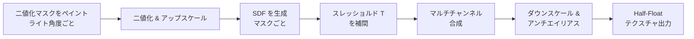

<p align="center">
  <h1 align="center">QuickSDFTool</h1>
  <p align="center">
    トゥーン/セルシェーディング向け SDF ベーススレッショルドマップを作成する Unreal Engine 5 エディターモードプラグイン
    <br />
    <a href="#機能">機能</a> · <a href="#インストール">インストール</a> · <a href="#クイックスタート">クイックスタート</a> · <a href="./README.md">English</a>
  </p>
</p>

> [!NOTE]
> **ステータス: プロトタイプ** — 本プロジェクトは開発中です。API、ワークフロー、UI は予告なく変更される可能性があります。

---

## 概要

**QuickSDFTool** は、3Dメッシュ上で異なるライト角度ごとに二値化シャドウマスクをペイントし、それらを自動合成して高品質な **SDF（Signed Distance Field）スレッショルドマップ** を生成するエディター専用ツールです。生成されたテクスチャは UV 空間でのライトからシャドウへの滑らかな遷移を符号化し、アニメ/トゥーンレンダリングにおいてライト方向ごとのシャドウ配置を制御するために使用されます。

### SDF スレッショルドマップとは？

トゥーン/セルシェーディングパイプラインにおいて、SDF スレッショルドマップはライト角度の関数としてテクセルごとのシャドウ遷移閾値を格納します。ライト方向のドット積と格納された閾値を比較することで、単純な N·L 閾値処理よりもはるかに優れた、アーティストが制御可能で解像度非依存のシャドウ境界を実現します。

---

## 機能

- **カスタムエディターモード** — UE5 エディターモード（`Quick SDF`）としてモードセレクターツールバーからアクセス可能。Interactive Tools Framework 上に構築
- **メッシュ直接ペイント** — `BaseBrushTool` パイプラインを使用してビューポート内の Static Mesh にリアルタイムプレビュー付きで二値化シャドウマスクを直接ペイント
- **2D UV キャンバスペイント** — HUD オーバーレイの 2D テクスチャプレビュー上でペイントし、精密な制御が可能。メッシュサーフェスと UV キャンバスのシームレスなデュアル入力対応
- **空間タイムライン UI** — キーフレームをライト角度で管理するビューポートオーバーレイタイムラインウィジェット：
  - サムネイルプレビュー付きのドラッグ可能なキーフレームハンドル
  - 5° 刻みのグリッドスナップ
  - キーフレームの追加・削除コントロール
  - `DirectionalLight` の自動同期
- **シンメトリーモード** — ライト角度を対称化（0°〜90°）して SDF マップを生成し、必要なマスク数を削減
- **オニオンスキン** — 隣接キーフレームテクスチャの半透明オーバーレイで角度間の滑らかな遷移を確認
- **オリジナルシェーディングから自動フィル** — 現在のビューポートライティング（マテリアルベーキング）をキーフレームの初期値としてベイク
- **SDF 生成パイプライン**
  - Felzenszwalb & Huttenlocher 距離変換による CPU 側 SDF
  - Compute Shader による GPU 加速 Jump Flooding Algorithm（JFA）
  - SDF 計算前のオプション超解像アップスケーリング（1×〜8×）とアンチエイリアス付きダウンスケーリング
  - Monopolar / Bipolar フォーマットの自動検出
  - 非対称または複雑なシャドウプロファイル用のマルチチャンネル出力（R/G/B/A）
- **非破壊ワークフロー** — すべてのペイントデータは `UQuickSDFAsset`（Data Asset）に保存され、保存・再読み込み・反復が可能
- **完全な Undo / Redo** — ペイントストローク、キーフレーム編集、ブラシサイズ変更はすべて UE5 トランザクションでラップ
- **スムーズブラシ入力** — Catmull-Rom スプライン補間と設定可能なストロークスタビライゼーション・スペーシング

---

## アーキテクチャ

```
QuickSDFTool/
├── Content/
│   ├── Materials/        # プレビューマテリアル (M_PreviewMat)
│   ├── Textures/         # デフォルトテクスチャアセット
│   └── Widget/           # UMG ウィジェットブループリント
├── Shaders/
│   └── Private/
│       └── JumpFloodingCS.usf   # JFA Compute Shader (SM5+)
└── Source/
    ├── QuickSDFTool/              # ランタイムモジュール
    │   ├── QuickSDFAsset          # 角度データと SDF 結果の UDataAsset
    │   └── QuickSDFToolModule     # モジュール登録
    ├── QuickSDFToolEditor/        # エディターモジュール
    │   ├── QuickSDFEditorMode     # UEdMode 実装、ライト管理
    │   ├── QuickSDFPaintTool      # コアペイントツール (BaseBrushTool)
    │   ├── QuickSDFSelectTool     # ターゲットメッシュ選択ツール
    │   ├── QuickSDFToolSubsystem  # 状態管理用エディターサブシステム
    │   ├── SDFProcessor           # CPU SDF 生成 & マルチチャンネル合成
    │   ├── SQuickSDFTimeline      # Slate ビューポートオーバーレイタイムラインウィジェット
    │   └── QuickSDFPreviewWidget  # UMG HUD プレビューウィジェット
    └── QuickSDFToolShaders/       # シェーダーモジュール
        ├── JumpFloodingCS         # Compute Shader C++ バインディング
        └── QuickSDFToolShadersModule
```

### ペイントツールのソース構成

`QuickSDFPaintTool` の実装は、エディターツールを保守しやすくするために責務ごとに分割されています。

| ファイル | 役割 |
|----------|------|
| `QuickSDFPaintTool.cpp` | ツールのセットアップ/終了処理、入力ビヘイビア登録、ターゲットコンポーネント切り替え |
| `QuickSDFPaintToolAsset.cpp` | SDF 生成、マスクのインポート/エクスポート、アセット同期、キーフレームとプロパティ処理 |
| `QuickSDFPaintToolRenderTarget.cpp` | Render Target のピクセル操作、Undo/Redo 用 change オブジェクト、ブラシマスクテクスチャ生成、プレビューマテリアル更新 |
| `QuickSDFPaintToolStroke.cpp` | ブラシストローク、ヒットテスト、UV プレビューペイント、Quick Line、ブラシサイズ変更 |
| `QuickSDFPaintToolHUD.cpp` | HUD プレビュー描画と UV オーバーレイ Render Target キャッシュ |
| `QuickSDFPaintToolBake.cpp` | オリジナルシェーディングのマテリアルベイクとマスクキーフレームへの反映 |
| `QuickSDFPaintToolPrivate.h/.cpp` | 内部共有の定数、ヘルパー関数、command change 型 |

### モジュール依存関係

| モジュール | タイプ | 主な依存関係 |
|-----------|--------|-------------|
| `QuickSDFTool` | Runtime | `Core`, `Engine` |
| `QuickSDFToolEditor` | Editor | `InteractiveToolsFramework`, `EditorInteractiveToolsFramework`, `GeometryCore`, `DynamicMesh`, `ModelingComponents`, `MeshConversion`, `MaterialBaking`, `Slate` |
| `QuickSDFToolShaders` | Runtime (PostConfigInit) | `Core`, `RenderCore`, `RHI` |

---

## 動作要件

| 要件 | バージョン |
|------|-----------|
| Unreal Engine | 5.7（5.7.4 で開発） |
| シェーダーモデル | SM5 以上 |
| プロジェクトタイプ | C++ プロジェクト（プラグインのコンパイルが必要） |

---

## インストール

1. リポジトリをクローンまたはダウンロード：
   ```bash
   git clone https://github.com/YOUR_USERNAME/QuickSDFTool.git
   ```

2. `QuickSDFTool/` フォルダをプロジェクトの `Plugins/` ディレクトリにコピー：
   ```
   YourProject/
   └── Plugins/
       └── QuickSDFTool/
           ├── QuickSDFTool.uplugin
           ├── Source/
           ├── Shaders/
           └── Content/
   ```

3. プロジェクトファイルを再生成してビルド：
   ```bash
   # Windows (Visual Studio)
   YourProject.uproject を右クリック → Visual Studio プロジェクトファイルを生成 → ビルド
   ```

4. エディターでプラグインを有効化：
   **編集 → プラグイン → "QuickSDFTool" を検索 → 有効化 → エディターを再起動**

---

## クイックスタート

1. **モードに入る** — ビューポートツールバーのエディターモードドロップダウンから `Quick SDF` を選択
2. **メッシュを選択** — シーン内の Static Mesh アクターをクリック。SDF プレビューマテリアルに切り替わります
3. **キーフレームを設定** — ビューポート下部のタイムラインオーバーレイでキーフレームを追加・削除し、目的のライト角度を設定
4. **シャドウをペイント** — LMB でライト（白）、Shift+LMB でシャドウ（黒）をメッシュまたは 2D UV プレビューにペイント
5. **角度を切り替え** — タイムラインのキーフレームをクリックして角度を切り替え。プレビューライトが連動して回転します
6. **SDF を生成** — 詳細パネルの **「Generate SDF Threshold Map」** をクリックして合成パイプラインを実行
7. **エクスポート** — 最終テクスチャは `/Game/QuickSDF_GENERATED/` に保存されます

### 操作方法

| 入力 | アクション |
|------|-----------|
| LMB ドラッグ | ライトをペイント（白） |
| Shift + LMB ドラッグ | シャドウをペイント（黒） |
| Ctrl + F + マウス移動 | ブラシサイズ変更 |
| タイムラインキーフレームクリック | 角度を選択 |
| タイムラインキーフレームドラッグ | 角度を調整 |
| Ctrl + Z / Ctrl + Y | 元に戻す / やり直し |

---

## TODO

> [!IMPORTANT]
> 本プロジェクトはプロトタイプです。以下の項目が計画または検討中です：

- [ ] **GPU 加速 SDF** — SDF 生成を CPU（Felzenszwalb）から既存の JFA Compute Shader を使用した完全 GPU ベースに移行
- [ ] **Skeletal Mesh サポート** — ペイントターゲットを Static Mesh 以外に拡張
- [ ] **バッチ処理** — 複数メッシュ / LOD の一括処理
- [ ] **カスタムブラシ形状** — カスタムブラシアルファテクスチャのインポート対応
- [ ] **筆圧感知** — タブレットの筆圧によるブラシ不透明度/サイズ制御
- [ ] **自動保存 / ホットリロード** — ペイントデータの定期チェックポイント保存
- [ ] **マルチ UV チャンネルプレビュー** — 異なる UV レイアウトの同時可視化
- [ ] **ドキュメント & チュートリアル** — ビデオウォークスルーと詳細な Wiki
- [ ] **Marketplace / Fab 対応準備** — 公開配布に向けたクリーンアップ
- [ ] **ユニット & 統合テスト** — SDF 生成パイプラインの自動テスト
- [ ] **パフォーマンスプロファイリング** — 高解像度テクスチャ（4K+）向けのベンチマークと最適化
- [ ] **ローカリゼーション** — 多言語 UI 対応
- [ ] **アイコン & ブランディング** — カスタムエディターモードアイコンとプラグインブランディングアセット

---

## 仕組み



1. **ペイント** — 各ライト角度に対して、メッシュ上に二値化シャドウマスクをペイント
2. **SDF** — 各マスクを Felzenszwalb & Huttenlocher アルゴリズムで符号付き距離場に変換
3. **補間** — 隣接するマスク間の境界を SDF ゼロ交差補間で特定し、テクセルごとの閾値 *T*（0〜1）を算出
4. **合成** — 閾値を RGBA チャンネルにパッキング：
   - **Monopolar**（対称）：すべてのチャンネルに同一の閾値を格納
   - **Bipolar**（非対称）：R = シャドウ侵入（0°〜90°）、B = シャドウ退出（0°〜90°）、G = シャドウ侵入（90°〜180°）、A = シャドウ退出（90°〜180°）
5. **エクスポート** — 最終テクスチャは精度のため 16-bit Half-Float テクスチャとして出力

---

## コントリビューション

コントリビューション大歓迎です！以下の手順でお願いします：

1. リポジトリをフォーク
2. フィーチャーブランチを作成（`git checkout -b feature/amazing-feature`）
3. 変更をコミット（`git commit -m 'Add amazing feature'`）
4. ブランチにプッシュ（`git push origin feature/amazing-feature`）
5. プルリクエストを作成


---

## 謝辞

- [Unreal Engine Interactive Tools Framework](https://docs.unrealengine.com/5.0/en-US/interactive-tools-framework-in-unreal-engine/) — ペイントツールの基盤
- Felzenszwalb & Huttenlocher — *Distance Transforms of Sampled Functions* (2012) — SDF アルゴリズム
- Jump Flooding Algorithm (JFA) — GPU 加速距離場計算
