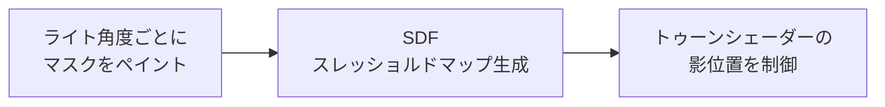

<p align="center">
  
</p>

<h1 align="center">QuickSDFTool</h1>

<p align="center">
  Unreal Engine 5 上で、トゥーン影用マスクをペイントして SDF スレッショルドマップを生成するエディターモードプラグイン。
  <br>
  <a href="#デモ">デモ</a> · <a href="#クイックスタート">クイックスタート</a> · <a href="#制作向けユースケース">ユースケース</a> · <a href="./README.md">English</a>
</p>

> [!NOTE]
> **ステータス: プロトタイプ。** QuickSDFTool は実験や小規模な制作検証に使える状態ですが、安定版までは API、UI、保存アセット形式が変更される可能性があります。

## デモ

QuickSDFTool は、複数のライト角度ごとに 3D メッシュ上へ二値化された明暗マスクをペイントし、それらをトゥーン/セルシェーディング用の高精度 SDF スレッショルドテクスチャへ合成します。

https://github.com/user-attachments/assets/1eb770b6-b65d-44bb-b5a0-fbb78d998202

基本ワークフローは次の通りです。



## 現在できること

- `Quick SDF` という専用 UE5 エディターモード。
- Static Mesh / Skeletal Mesh への直接ペイント。
- テクスチャ空間で調整しやすい 2D UV プレビューペイント。
- サムネイル、スナップ、追加/削除、`DirectionalLight` 同期付きの角度タイムライン。
- シンメトリーモード、オニオンスキン、クイックストローク、全角度同時ペイント。
- マスクのインポート/エクスポート、非破壊 `UQuickSDFAsset` 保存、Undo/Redo。
- CPU SDF 生成、1x-8x アップスケール、half-float テクスチャ出力。
- `Content/Materials/` にプレビュー/トゥーン用マテリアルを同梱。

## SDF スレッショルドマップとは？

一般的なトゥーン影は `N dot L` のしきい値で切りますが、これだけだと法線やメッシュ形状の影響を強く受けます。SDF スレッショルドマップは、アーティストが決めた「この角度でここまで影にする」という遷移情報を UV 空間に保存します。

```text
ペイント済み明暗マスク -> SDF 補間 -> RGBA threshold texture -> 制御しやすいトゥーン影
```

物理的に正しい影よりも、キャラデザインとして気持ちいい影を優先したい場面に向いています。

## 制作向けユースケース

- **顔影:** 頬、鼻、口元、目元の影をライト回転に合わせて破綻しにくく制御。
- **髪影:** 前髪や横髪の影を、細かい法線に頼らず整理された帯として表現。
- **服の影:** グラフィックな折り目影をトゥーンマテリアル上で安定させる。
- **小規模制作:** 外部ツールとの往復を減らし、UE エディター内で影マスクを反復。

## クイックスタート

まず結果を見るための最短手順です。

1. このリポジトリを C++ Unreal プロジェクトの `Plugins/QuickSDFTool/` にコピーします。
2. プロジェクトファイルを再生成し、ビルド後に **QuickSDFTool** を有効化してエディターを再起動します。
3. エディターモードセレクターから **Quick SDF** を選びます。
4. レベル内のメッシュを選択します。
5. `LMB` で白、`Shift + LMB` で黒/影をペイントします。
6. タイムラインキーを追加または移動してライト角度を設定します。
7. ツール詳細から **Create Threshold Map** または **Generate SDF Threshold Map** を実行します。
8. `/Game/QuickSDF_GENERATED/` の生成テクスチャをトゥーンマテリアルに接続します。

詳しくは [Examples](./Examples/README.md)、[Material Setup](./Docs/MaterialSetup.md)、[Troubleshooting](./Docs/Troubleshooting.md) を参照してください。

## インストール

1. リポジトリをクローンまたはダウンロードします。

   ```bash
   git clone https://github.com/yeczrtu/QuickSDFTool.git
   ```

2. プロジェクトに配置します。

   ```text
   YourProject/
   └── Plugins/
       └── QuickSDFTool/
           ├── QuickSDFTool.uplugin
           ├── Source/
           ├── Shaders/
           └── Content/
   ```

3. プロジェクトファイルを再生成してビルドします。

   ```text
   YourProject.uproject を右クリック -> Visual Studio project files を生成 -> ビルド
   ```

4. プラグインを有効化します。

   ```text
   Edit -> Plugins -> "QuickSDFTool" を検索 -> Enable -> Restart Editor
   ```

## 互換性

| Unreal Engine version | 状態 |
| --- | --- |
| 5.7.4 | 開発・検証ターゲット |
| 5.7.x | 動作見込み、リリース検証は未完了 |
| 5.6 | 未検証 |
| 5.5 | 未検証 |
| 5.4 | 未検証 |

QuickSDFTool は、開発時に使用している Interactive Tools Framework、Modeling Components、Material Baking、シェーダーモジュールまわりの挙動に合わせて UE 5.7 を対象にしています。過去バージョンへの対応は可能性がありますが、現時点では未検証です。

## 操作方法

| 入力 | アクション |
| --- | --- |
| `LMB Drag` | 白/ライトをペイント |
| `Shift + LMB Drag` | 黒/影をペイント |
| `Ctrl + F + Mouse Move` | ブラシサイズ変更 |
| `Timeline Key Click` | 角度選択 |
| `Timeline Key Drag` | 角度調整 |
| `Ctrl + Z / Ctrl + Y` | Undo / Redo |

## 機能

- **カスタムエディターモード** — UE5 のモードセレクターから利用できる専用モード。
- **メッシュ直接ペイント** — 対象メッシュ表面へリアルタイムプレビュー付きでペイント。
- **2D UV キャンバスペイント** — テクスチャ空間で細部を調整。
- **角度タイムライン UI** — ライト角度ごとのキーフレームをサムネイル付きで管理。
- **オリジナルシェーディングから自動フィル** — 現在のライティングを初期マスクとしてベイク。
- **SDF 生成パイプライン** — SDF 補間と RGBA パッキングで threshold map を生成。
- **非破壊ワークフロー** — `UQuickSDFAsset` に作業状態を保存して反復可能。

## ロードマップ

> [!IMPORTANT]
> ロードマップは、初めて触るアーティストが安心して試せるようにする優先度で並べています。

### P0: プレビューリリースの信頼性

- [ ] SDF 出力方向を確定し、ドキュメント化する。
- [ ] タイムラインのサムネイル/ハンドル位置ずれを修正する。
- [ ] UV 依存のブラシサイズ差を改善、または明確に説明する。
- [ ] マスクペイント -> SDF テクスチャ -> トゥーンシェーダー結果の短尺動画を追加する。
- [ ] `v0.1.0-preview` をリリースし、導入確認手順を添える。

### P1: パフォーマンスと互換性

- [ ] GPU JFA SDF 経路をユーザーが使う生成フローに接続する。
- [ ] 1K、2K、4K のマスクワークフローをベンチマークする。
- [ ] UE 5.6、5.5、5.4 の互換性を検証、または必要変更点を記録する。

### P2: ペイント体験の強化

- [ ] カスタムブラシアルファテクスチャをインポートする。
- [ ] タブレット筆圧でブラシサイズ/不透明度を制御する。
- [ ] 現在のタイムラインフレームとマスクデータを複製する。
- [ ] 前後タイムライン移動ボタンとショートカットを追加する。
- [ ] 未保存マスク変更の自動保存/ホットリロード復元を追加する。

## 仕組み

1. **ペイント** — ライト角度ごとにメッシュまたは UV プレビューへ二値マスクを描きます。
2. **SDF** — 各マスクを符号付き距離場に変換します。
3. **補間** — 隣接マスク間の遷移を探し、しきい値 `T` を求めます。
4. **合成** — 値を RGBA チャンネルへ格納します。
   - **Monopolar:** 対称影向け。RGB に同じしきい値を格納。
   - **Bipolar:** 非対称影向け。侵入/退出値を RGBA に分けて格納。
5. **出力** — 最終 threshold map を 16-bit half-float テクスチャとして保存します。

## GitHub 公開チェックリスト

メンテナー向け:

- Topics に `unreal-engine`, `ue5`, `toon-shading`, `cel-shading`, `sdf`, `editor-plugin`, `technical-art` を追加。
- `.github/assets/social-preview.svg` を GitHub Social Preview に設定、または PNG に書き出して設定。
- [リリースノート](./Docs/ReleaseNotes/v0.1.0-preview.md) を使って `v0.1.0-preview` を作成。

## 既知の不具合

- UV レイアウトによって、ブラシサイズと実際のペイント範囲が一致しない場合があります。
- タイムラインのサムネイル/ハンドルが操作後にずれる場合があります。
- SDF 出力方向はプレビューマテリアルと照合して最終確認が必要です。
- GPU JFA シェーダーは存在しますが、公開生成フローは現在 CPU `FSDFProcessor` 経路です。

## コントリビューション

ドキュメント、UE バージョン検証、小さなワークフロー修正、サンプル追加は特に歓迎です。

## 謝辞

- [Unreal Engine Interactive Tools Framework](https://docs.unrealengine.com/5.0/en-US/interactive-tools-framework-in-unreal-engine/) — エディターペイントワークフローの基盤。
- Felzenszwalb & Huttenlocher — *Distance Transforms of Sampled Functions* (2012)。
- Jump Flooding Algorithm (JFA) — GPU 距離場生成の参考。
- [UE5 SDF Face Shadow Mapping article](https://unrealengine.hatenablog.com/entry/2024/02/28/222220)。
- [SDF Texture and LilToon note](https://note.com/ca__mocha/n/n9289fbbc4c8b)。
