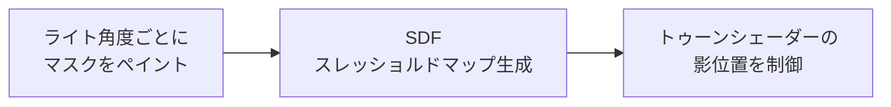

<h1 align="center">QuickSDFTool</h1>

<p align="center">
  Unreal Engine 5 でトゥーン影マスクをペイントし、SDF スレッショルドマップを生成するエディターモードプラグイン。
  <br>
  <a href="#デモ">デモ</a> | <a href="#クイックスタート">クイックスタート</a> | <a href="#制作向けユースケース">ユースケース</a> | <a href="./README.md">English</a>
</p>

> [!NOTE]
> **ステータス: プレビュー / ベータ。** QuickSDFTool は実験や小規模な制作検証に使える段階ですが、安定版までは API、UI、保存アセットの細部が変わる可能性があります。

## デモ

QuickSDFTool は、複数のライト角度ごとにメッシュ上へ二値の明暗マスクをペイントし、それらをトゥーン / セルシェーディング向けの高精度 SDF スレッショルドテクスチャへ合成します。

https://github.com/user-attachments/assets/1eb770b6-b65d-44bb-b5a0-fbb78d998202

基本ワークフローは次の通りです。



## 現在使える機能

- `Quick SDF` という専用 UE5 エディターモード。
- Static Mesh / Skeletal Mesh コンポーネントへの直接ペイントと、マテリアルスロットのビューポート分離およびスロット単位のヒットテスト。
- 行クリックで選択できるコンパクトな `Material Slots` リスト、`Baked` / `Empty` ステータスピル、選択スロットだけを Bake するスロット単位の Bake 操作。複数スロット一括 Bake は基本ワークフローから外しています。
- UV ガイド、元シェーディングのオーバーレイ、オニオンスキンに対応した 2D UV プレビューペイント。
- 上段シークレーンと下段キーフレームレーンに分離した角度タイムライン。サムネイル、見やすい角度ラベル、5 度スナップ、追加 / 複製 / 削除、シンメトリー対応のマスク補完、均等配置、`DirectionalLight` 同期に対応しています。
- `Current`、`All`、`Before`、`After` の Paint Target 範囲ハイライトと、mask / `Monotonic Guard` / warning を示すタイムラインステータスバッジ。詳細ツールチップも表示します。
- モードが左右矢印キーを処理している間、ビューポート移動を抑制する前後フレーム移動。
- Current、All、Before Current、After Current の Paint Target モード。
- 前半角度を扱うシンメトリーモード、ホールド式クイックストローク、全角度ペイント系ワークフロー、スイープ範囲に応じた 8 マスク / 15 マスクの標準補完。
- 角度マスク間で同じ UV ピクセルが何度も明暗反転しないように、ペイント時にサイレントでクリップする Monotonic Guard。SDF 生成前の検証警告にも対応しています。
- Lazy Radius によるストローク安定化、筆圧による半径変化、アンチエイリアス付きブラシエッジ、1K-4K Render Target ペイントの最適化。
- ファイルピッカーまたはタイムラインへのドラッグ & ドロップからのマスクインポート、マスクエクスポート、非破壊の `UQuickSDFAsset` 保存、UE トランザクションベースの Undo / Redo。
- Monopolar / Bipolar の自動パッキング、1x-8x アップスケール、half-float テクスチャ出力に対応した CPU SDF 生成。
- `Content/Materials/` に含まれるプレビュー / トゥーン用マテリアル例。

## SDF スレッショルドマップとは？

一般的なトゥーン影は `N dot L` のしきい値で切り替えることが多く、法線やメッシュトポロジーの影響を強く受けます。SDF スレッショルドマップは、アーティストが決めた「どのライト角度でどこまで影になるか」という遷移情報を UV 空間に保存します。シェーダー側ではライト方向とテクスチャ値を比較するため、顔、髪、服などで意図したアニメ調の影形状を作りやすくなります。

概念的には次の流れです。

```text
ペイント済み明暗マスク -> SDF 補間 -> RGBA threshold texture -> 制御しやすいトゥーン影
```

物理的に正しい影よりも、キャラクターデザインとして気持ちよい影を優先したい場面に向いています。

## 制作向けユースケース

- **顔の影:** 頬、鼻、口元、目元の影形状を、ライト回転に合わせて破綻しにくく制御できます。
- **髪の影:** 前髪や横髪の影を、細かい法線に頼らず整理された帯として表現できます。
- **服の影:** グラフィックな折り目影を、スタイライズされたマテリアル上で安定させます。
- **小規模制作:** 外部ツールとの往復を減らし、UE エディター内で影マスクを反復できます。

## クイックスタート

まず結果を確認するための最短手順です。

1. このリポジトリを C++ Unreal プロジェクトの `Plugins/QuickSDFTool/` にコピーします。
2. プロジェクトファイルを再生成し、ビルド後に **QuickSDFTool** を有効化してエディターを再起動します。
3. エディターモードセレクターから **Quick SDF** を選びます。
4. レベル内のメッシュを選択します。
5. **Material Slots** で編集したい行をクリックします。ソースマスクが必要な場合は、その行の小さな Bake アイコンを使います。
6. `LMB` で白 / ライト、`Shift + LMB` で黒 / 影をペイントします。
7. タイムライン上段でライト角度をシークし、下段のキーフレームレーンで選択、追加、複製、削除、ドラッグ移動を行います。
8. 現在マスクのみ、全マスク、現在より前 / 後の範囲へストロークを反映したい場合は Paint Target モードを選びます。タイムラインのハイライト範囲が編集対象を示します。
9. ツール詳細の **Generate Selected SDF** または **Generate SDF Threshold Map** を実行します。
10. `/Game/QuickSDF_GENERATED/` に生成されたテクスチャをトゥーンマテリアルで使います。

詳しい流れは [Examples](./Examples/README.md)、[Material Setup](./Docs/MaterialSetup.md)、[Troubleshooting](./Docs/Troubleshooting.md) を参照してください。

## インストール

QuickSDFTool には Unreal Engine 5.7 以降と C++ Unreal プロジェクトが必要です。

1. リポジトリをクローンまたはダウンロードします。

   ```bash
   git clone https://github.com/yeczrtu/QuickSDFTool.git
   ```

2. プロジェクトに配置します。

   ```text
   YourProject/
   |-- Plugins/
       |-- QuickSDFTool/
           |-- QuickSDFTool.uplugin
           |-- Source/
           |-- Shaders/
           |-- Content/
   ```

3. プロジェクトファイルを再生成してビルドします。

   ```text
   YourProject.uproject を右クリック -> Generate Visual Studio project files -> Build
   ```

4. プラグインを有効化します。

   ```text
   Edit -> Plugins -> "QuickSDFTool" を検索 -> Enable -> Restart Editor
   ```

## 互換性

| Unreal Engine version | ステータス |
| --- | --- |
| 5.7.4 | 開発・検証ターゲット |
| 5.7.x | サポート対象 |
| 5.8+ | 対応予定。ただしリリース検証は未実施 |
| 5.6 以前 | 非対応 |

QuickSDFTool は UE 5.7 以降のみを対象にしています。エディターツールは UE 5.7 開発時点の Interactive Tools Framework、Modeling Components、Material Baking、シェーダーモジュール周辺の挙動に依存しているため、UE 5.6 以前はサポート対象外です。

## 操作方法

| 入力 | アクション |
| --- | --- |
| `LMB Drag` | 白 / ライトをペイント |
| `Shift + LMB Drag` | 黒 / 影をペイント |
| `Ctrl + F`, マウス移動, クリック | マウスがビューポート上にあるときだけブラシサイズを変更 |
| `Alt + T` | クイックトグルメニューを開く |
| `Alt + 1` | Paint Target モードを切り替え |
| `Alt + 2` - `Alt + 9` | Auto Light、Preview、UV overlay、Shadow overlay、Onion Skin、Quick Stroke、Symmetry、Monotonic Guard を切り替え |
| `Left / Right Arrow` | 前 / 次のタイムラインフレームを選択 |
| `Material Slot Row Click` | 編集するマテリアルスロット / Texture Set を選択 |
| `Material Slot Bake Icon` | そのスロットだけを Bake |
| `Timeline Seek Lane Click / Drag` | キーフレームを動かさずにプレビューライト角度をシーク |
| `Timeline Key Click` | 角度を選択 |
| `Timeline Key Drag` | ドラッグしきい値を超えたあとに角度を調整 |
| `Timeline Status Badge Hover` | 角度、テクスチャ、編集状態、Paint Target 範囲、Guard、上書き可否、警告内容を確認 |
| `Timeline Add / Duplicate / Delete` | キーフレームを作成、コピー、削除 |
| `Timeline 8 or 15 / Even` | 標準マスク数へ補完、または角度を均等配置。シンメトリー ON では 8 マスク、OFF では 15 マスクへ補完 |
| `Texture2D` アセットをタイムラインへドラッグ | 編集済みマスクをインポート |
| `Ctrl + Z / Ctrl + Y` | Undo / Redo |

## 機能

- **カスタムエディターモード:** UE5 のモードセレクターから使える専用モードを登録します。
- **メッシュ直接ペイント:** 対象メッシュ表面へリアルタイムプレビュー付きでペイントし、マテリアルスロット単位のフィルタリングも使えます。
- **Material Slot ワークフロー:** 行クリックでスロットを選択し、`Baked` / `Empty` の状態を小さなピルで確認し、行アクションからアクティブスロットだけを Bake します。トゥーン影マスク編集はスロット単位の作業が中心になるため、一括 Bake 系ボタンは標準 UI から外しています。
- **2D UV キャンバスペイント:** HUD 上のテクスチャプレビューで、UV 空間を見ながら細部を調整できます。
- **Paint Target モード:** 現在マスク、全マスク、タイムライン上の前 / 後範囲へストロークを反映します。範囲ハイライトは、実際の編集処理と同じ隣接角度の中点基準で計算されます。
- **タイムラインステータスバッジ:** 各キーに mask の有無、Guard の有効状態、warning 状態を小さく表示します。ツールチップにはテクスチャ名または `Missing`、Paint Target への含まれ方、上書き状態、警告メッセージをまとめて表示します。
- **Monotonic Guard / クリッピングマスク:** 有効時は通常ブラシと Quick Stroke の確定時に、同じ UV ピクセルが角度マスク間で複数回反転しないようにクリップします。現在マスクだけのストロークでも周辺の処理対象マスク列と比較し、戻すのはそのストロークで変更されたピクセルだけです。インポート、リベイク、SDF 生成では自動修正せず、検証警告のみを表示します。
- **ブラシフィール調整:** Lazy Radius によるストローク安定化、細かいスタンプ間隔、アンチエイリアス付きブラシマスク、タブレット向けの筆圧ブラシ半径に対応します。
- **角度タイムライン UI:** シーク専用レーンとキーフレームレーンを分け、見やすいサムネイル区切り、ステータスバッジ、追加 / 複製 / 削除、スナップ、シンメトリー対応の補完、均等配置を提供します。
- **プレビューライトワークフロー:** モード中は既存 `DirectionalLight` を一時的にミュートし、プレビューライトで角度を確認します。終了時や保存時に元の強度へ戻します。
- **元シェーディングからの自動フィル:** 現在のビューポート / マテリアルのライティングを、初期マスクとして Bake できます。
- **マスク I/O:** 画像ファイルまたはタイムラインドロップから編集済みマスクを取り込み、外部編集用にマスクを書き出せます。
- **SDF 生成パイプライン:** SDF 補間、Monopolar / Bipolar の自動 RGBA パッキング、half-float テクスチャ出力で threshold map を生成します。
- **非破壊ワークフロー:** 作業状態を `UQuickSDFAsset` に保存し、必要に応じてマスクテクスチャも一緒に保存しながら反復できます。

## Material Slots

`Quick SDF > Material Slots` は、アーティストが 1 つのマテリアルスロットを選んで編集する一般的な作業に合わせています。

- 行をクリックすると、対応する Texture Set が選択され、ペイント / Bake 対象が切り替わります。
- マテリアルスロットを選択すると、既定でそのスロットだけがビューポートに分離表示されます。
- ペイントのピックとストロークサンプリングは選択中スロットを編集フィルターとして使うため、非対象スロットがアクティブスロットのヒットを奪いません。
- 各行にはスロット番号、スロット名、マテリアル名、`Baked` / `Empty` などのコンパクトなステータスピルを表示します。
- 行右端のアクションボタンはそのスロットだけを Bake し、元シェーディングマスクの Bake Scope として選択中スロットを使用します。
- アクティブ行には控えめなアクセント、少し明るい背景、境界線を付け、Details Panel 内でも現在の編集対象を見失いにくくしています。
- スロット数が多いメッシュでも、リストはスクロール領域に収まり、他のツール UI を押し下げすぎないようにしています。

## Timeline

タイムラインは、シーク操作とキーフレーム操作の誤操作を減らすため、2 つのレーンに分かれています。

- 上段のシークレーンだけが、クリック / ドラッグによるプレビュー角度のシークを処理します。現在のライト / シークカーソルと角度目盛りを表示します。
- 下段のキーフレームレーンにはサムネイルとキーハンドルを配置します。キーフレームはクリックで選択され、ドラッグしきい値を超えた場合だけ移動します。
- サムネイル背景は入力を持たず、キーフレームウィジェットだけが選択とドラッグを処理します。
- `Current`、`All`、`Before`、`After` の Paint Target 範囲ハイライトを常時表示します。表示範囲は隣接角度の中点から計算するため、実際に編集されるマスク範囲と一致します。
- キーのステータスバッジは hit-test invisible で、選択、ドラッグ、インポート、シークの邪魔をしません。
- ベクターレイヤーバッジは、将来の Quick Nose / Quick Reshape 向けの内部プレースホルダーとして存在しますが、現時点では非表示です。

## Monotonic Guard

`Monotonic Guard` は、SDF スレッショルドマスク向けの任意のペイント時安全機能です。`R >= 127` を白、それ未満を黒として扱い、処理対象の角度列で `black -> white -> black` や `white -> black -> white` のような複数回反転が生まれないようにします。

- クイックトグル上の表示名は `Guard`、ショートカットは `Alt + 9` です。
- `Clip Direction` の標準は `Auto` です。`0-90` 度では `White Expands`、`90-180` 度では `White Shrinks` として扱います。手動指定として `White Expands` / `White Shrinks` も選べます。
- 通常ブラシと Quick Stroke は、Undo 差分が確定する前にサイレントでクリップされます。ペイント操作は止めず、ブラシ中の通知も表示しません。
- アンチエイリアスされた半透明エッジもストローク意図として扱います。ピクセルが明るくなった場合は白方向、暗くなった場合は黒方向のストロークとして判定するため、`127` の二値しきい値をまたがない場合もクリップ対象になります。
- `Current / All / Before / After` は、どのマスクへストロークを書き込むかを決めます。Guard は関連する処理対象マスク列で判定し、現在のストロークで変更されたピクセルだけを開始前の状態へ戻します。
- インポート済みマスク、リベイク済みマスク、SDF 生成は自動修正されません。既存違反は `Validate Monotonic Guard` アクション、または Guard 有効状態での SDF 生成時に警告として確認できます。

## ロードマップ

> [!IMPORTANT]
> ロードマップは、初めて触るアーティストが安心して試せるようにするための優先度で並べています。

### P0: プレビューリリースの信頼性

- [ ] SDF 出力方向を確定し、ドキュメント化する。
- [ ] UV 依存のブラシサイズ差を改善するか、明確に説明する。
- [ ] マスクペイント -> SDF テクスチャ -> トゥーンシェーダー結果の短い動画を追加する。
- [ ] プレビューリリースごとにリリースノートと導入確認手順を添える。

### P1: パフォーマンスと互換性

- [ ] GPU JFA SDF 経路をユーザー向け生成フローで有効化する。
- [ ] 1K、2K、4K のマスクワークフローをベンチマークする。
- [ ] 新しいエンジンバージョンに合わせて UE 5.7+ 互換性メモを更新する。

### P2: ペイント体験の強化

- [ ] カスタムブラシアルファテクスチャのインポート。
- [ ] より豊富なブラシプリセットと、任意のカスタムフォールオフ制御。
- [ ] キーボード操作だけでは足りない場合に備えた、明示的な前 / 次タイムラインボタン。
- [ ] 未保存マスク変更の autosave / hot-reload recovery。

### 計画中の機能要件

> [!NOTE]
> ここは将来作業の要件です。現在のプレビュー版では利用できず、将来リリースで明示されない限り、現在の C++ API、`UQuickSDFAsset` 形式、Slate UI、ショートカット、アセット形式は変更しません。

#### Quick Nose

- `Quick Nose` は、アーティストが指定した鼻位置から鼻影プリセットを素早く配置するための非破壊ベクターレイヤーとして追加します。
- プリセットは位置、回転、スケール、カーブ形状、制御点を編集できるようにし、最終形ではなく高速な出発点として使えるようにします。
- Bake は現在マスクまたは複数マスク範囲に対応し、Undo 可能で、あとから編集できるよう元のベクターレイヤーを保持します。

#### Quick Reshape

- `Quick Reshape` は仮称で、より高レベルな境界線作成ワークフローとして扱います。アーティストは 1 つの非破壊 UV キャンバスガイドレイヤーに複数の `Boundary Line` カーブを描き、それぞれに `Assigned Angle` を割り当てます。
- 各境界線は、割り当てられたマスクの明暗分割線を表します。`Bake Matching Angles` は、境界線が割り当てられている角度マスクだけを生成または更新し、全タイムラインマスクは更新しません。
- 境界線は編集可能なベクターデータとして保存し、Bake 後も位置やカーブ形状を調整して再 Bake できるようにします。
- 白 / 黒の塗り側は、角度と線方向から推定する `Auto Side` を標準にし、必要に応じて `Invert Side` で線ごとに補正します。
- 有効な境界線は、アクティブ UV アイランドを分割するか閉じた領域を作る必要があります。曖昧な部分線は Bake 前に警告し、塗りはアクティブ UV アイランド内に制限します。
- `Quick Reshape` は `Stroke Auto Fill` と分けて扱います。`Stroke Auto Fill` は単一線のフィル補助で、`Quick Reshape` は複数角度の境界計画からマスクを作る機能です。
- `Monotonic Guard` が Quick Reshape の出力を Bake 中または Bake 後に検証し、`black -> white -> black` や `white -> black -> white` の反転を検出できるようにします。

#### Brush Projection Mode

- 最終的な画面上の見た目を基準にペイントしたいアーティスト向けに、簡潔な `Brush Projection Mode` オプションを追加します。
- 初期版は小さく保ちます。`Surface / UV` は現在の精密なテクスチャ空間ワークフローを維持し、`View Projected` は画面空間のブラシ形状を表示して可視メッシュ面へ投影します。
- `View Projected` は Blender / Substance 風のカメラ投影ペイントに近い感覚で、UV 空間のブラシ形状より見た目のシルエットを重視する顔影設計に向けます。
- 最初から投影、整列、サイズ空間の大量オプションは出さず、素早いモード切り替えを優先します。
- 投影ブラシは標準で可視ヒット面だけに作用し、背面や隠れた面への塗り抜けを避けます。
- 半径、フォールオフ、アンチエイリアス、筆圧半径、Quick Stroke、Paint Target モードなど既存のブラシ制御は、可能な範囲で両方の投影モードに対応します。
- 同じストロークでもモードによって UV 上の結果が変わるため、ビューポートカーソルで現在の投影モードを明確に示します。

#### Actor Mesh Component Selection

- 1 つのアクターが複数のメッシュコンポーネントを持つ場合に、QuickSDFTool の編集対象メッシュを明確に選べない現在の制限を解消します。
- 選択中アクター内の対象候補として、`StaticMeshComponent` と `SkeletalMeshComponent` をコンポーネント単位で選べるターゲットピッカーを追加します。
- ピッカーにはコンポーネント名、メッシュアセット名、マテリアルスロット、表示状態など、対象を識別できる情報を表示します。
- ペイント、マスクインポート、マスクエクスポート、Bake、SDF 生成、マテリアルスロット分離は、アクター内の全メッシュではなく選択されたメッシュコンポーネントだけに適用します。
- メッシュコンポーネントを切り替えても、それぞれの QuickSDF アセット / マスク状態を保持し、顔、髪、服、アクセサリなどを 1 つのアクター内で個別に編集できるようにします。
- ビューポートピックに対応する場合は、複数メッシュアクター上のサーフェスクリックから可能な限りヒットしたメッシュコンポーネントを特定し、曖昧な場合はコンポーネントピッカーへフォールバックします。

#### Threshold Map Reverse Conversion

- 完成済みスレッショルドマップに対してライト角度を指定し、その角度のマスクを復元またはプレビューする逆変換ワークフローを追加します。
- 逆変換は、少なくともプレビュー、現在マスクへの抽出、新規マスクへの抽出に対応し、完成済みスレッショルドマップの確認や修正に使えるようにします。
- Monopolar / Bipolar のスレッショルドマップを逆変換するとき、指定角度に対してどのチャンネルまたは値ペアを解釈するかを明確にします。

#### Mask Freeze

- `Mask Freeze` は、編集中ではないマスクのペイント用 Render Target を解放し、VRAM 使用量を抑えるワークフローです。
- フリーズ済みマスクは、作成済みのマスク内容をアセット側データまたは CPU / ディスク側に保存されたテクスチャデータとして保持し、一時的な `PaintRenderTarget` は編集やプレビューで必要になるまで破棄できるようにします。
- thaw では保存済みマスクデータから Render Target を再作成し、見た目を変えずに通常のペイント状態へ戻します。
- 現在マスクの freeze、非アクティブな全マスクの freeze、現在マスクの thaw、全マスクの thaw を用意します。
- `All / Before / After`、一括塗り、Quick Reshape の Bake、将来的な複数マスク書き込み操作などでフリーズ済みマスクが編集対象に含まれる場合は、対象マスクを自動で thaw します。
- タイムラインキーには freeze / thaw 状態を示すバッジを表示し、すぐ編集できるマスクと復元が必要なマスクを識別できるようにします。
- SDF 生成、エクスポート、保存、Overwrite Source 系の処理では、フリーズ済みマスクを透過的に thaw するか保存済みデータを読み取り、出力からマスクが欠落しないようにします。
- Freeze / Thaw をまたいでも Undo / Redo でマスク内容が失われないようにします。

#### Stroke Auto Fill

- `Stroke Auto Fill` は、線を引いたあとに左右どちら側、または内側 / 外側のどちらを塗るかをプレビューして自動塗りつぶしする機能です。
- 現在マスクのみの編集と、`All / Before / After` による一括適用の両方に対応します。
- 意図しない別アイランドへの塗り漏れや染み出しを避けるため、塗りつぶしはアクティブな UV アイランド単位に制限します。
- 確定前にプレビューを表示し、確定後の結果は Undo できるようにします。

#### 受け入れシナリオ

- `Quick Nose` は、鼻位置指定、プリセット配置、ベクター調整、Bake、Undo の流れを確認します。
- `Quick Reshape` は、1 枚のガイドレイヤーに `0 / 30 / 60 / 90` 度など複数の境界線を描き、対応する角度マスクだけを更新し、Bake 後もガイドレイヤーを編集でき、UV アイランドを分割しない線や閉領域を作らない線では警告されることを確認します。
- `Brush Projection Mode` は、現在の `Surface / UV` 方式と `View Projected` ブラシを切り替えられ、画面上のブラシ形状を保ったまま塗れ、隠れた面や背面へ意図せずペイントしないことを確認します。
- `Actor Mesh Component Selection` は、複数のメッシュコンポーネントを持つ 1 つのアクターから 1 つの対象コンポーネントを選択でき、選択したコンポーネントだけをペイント / Bake し、コンポーネント切り替え時にも個別の QuickSDF 状態が保持されることを確認します。
- `Threshold Map Reverse Conversion` は、角度を指定して完成済みスレッショルドマップからマスクをプレビューし、修正や再利用のために抽出できることを確認します。
- `Mask Freeze` は、高解像度かつ複数マスク構成で VRAM 使用量を下げ、フリーズ済みマスクを見た目の変化なしに復元でき、複数マスク編集の前に対象マスクがすべて自動 thaw されることを確認します。
- `Stroke Auto Fill` は、現在マスクのみ、`Before / After / All`、UV アイランド分離、左右または内外の塗り選択を確認します。
- 英語版と日本語版 README の機能名、優先度、未実装ステータスが同期していることを確認します。

## 内部構成

```text
QuickSDFTool/
|-- Content/
|   |-- Materials/        # プレビュー / トゥーン用マテリアル
|   |-- Textures/         # デフォルトテクスチャ
|   |-- Widget/           # UMG ウィジェットブループリント
|-- Shaders/
|   |-- Private/
|       |-- JumpFloodingCS.usf
|-- Source/
    |-- QuickSDFTool/              # Runtime module と UQuickSDFAsset
    |-- QuickSDFToolEditor/        # Editor Mode、paint tool、timeline、processor
    |-- QuickSDFToolShaders/       # Compute shader binding
```

| Module | Type | Key Dependencies |
| --- | --- | --- |
| `QuickSDFTool` | Runtime | `Core`, `CoreUObject`, `Engine`, `RenderCore`, `RHI` |
| `QuickSDFToolEditor` | Editor | `InteractiveToolsFramework`, `EditorInteractiveToolsFramework`, `GeometryCore`, `DynamicMesh`, `MeshDescription`, `ModelingComponents`, `MeshConversion`, `EditorSubsystem`, `UMG`, `Slate`, `LevelEditor`, `PropertyEditor`, `MaterialBaking`, `DesktopPlatform`, `ImageWrapper`, `AssetRegistry` |
| `QuickSDFToolShaders` | Runtime / `PostConfigInit` | `Core`, `CoreUObject`, `Engine`, `RenderCore`, `RHI`, `Projects` |

### エディターコード構成

- `UQuickSDFAsset` は、編集中のマスク、解像度、UV チャンネル、最終 SDF テクスチャの主データ源としてアクティブな `FQuickSDFTextureSetData` を使います。旧トップレベルフィールドは、保存済みアセット互換のためロード時にベストエフォートで移行します。
- `UQuickSDFPaintTool` は Interactive Tools Framework のライフサイクル、入力ルーティング、UI コマンドを担当するファサードとして整理されています。ペイント状態、Undo 変更、マスクユーティリティ、SDF ヘルパー、アセット選択、Render Target 支援処理は責務別の private helper に分かれています。
- タイムラインキーフレーム描画はメインタイムラインウィジェットから分離されています。範囲 / キーステータス計算は `QuickSDFTimelineStatus` にあり、範囲ハイライト、バッジ、ツールチップを Slate なしでテストできます。
- マスクインポート検証は Slate に依存しない import model 側で扱うため、UI と取り込みルールを個別に保守できます。
- 開発用 Automation Test では、デフォルト角度、角度名パース、SDF エッジケース、アセット移行、マスクインポートモデル検証、`TimelineRangeStatus`、`TimelineKeyStatus`、Monotonic Guard の挙動を確認します。

### 開発時の検証

現在の開発対象は UE 5.7.x です。ローカル検証では、プラグインを有効化した C++ ホストプロジェクトをビルドし、`QuickSDFTool` の Automation Test グループを実行します。

Unreal Editor のコマンドラインまたは Session Frontend で使う主な検証コマンド:

```text
Automation RunTests QuickSDFTool
Automation RunTests QuickSDFTool.Core.Timeline
```

直近のリファクタリングは `sdfbuildEditor Win64 Development` と、タイムライン周辺の重点 Automation Test で検証しています。

## 仕組み

1. **ペイント:** ライト角度ごとに、メッシュまたは UV プレビューへ二値マスクを描きます。
2. **SDF:** 各マスクを符号付き距離場へ変換します。
3. **補間:** 隣接マスク間の遷移を探し、しきい値 `T` を求めます。
4. **合成:** Monopolar / Bipolar 出力を自動判定し、値を RGBA チャンネルへ格納します。
   - **Monopolar:** 対称的な影向け。0-90 / 90-180 を分ける場合は R/A に格納します。
   - **Bipolar:** 非対称な影向け。内部では従来の R/G/B/A で生成し、出力時に R/A/B/G へ並べ替えるため、B チャンネルは 0-90 退出値のまま維持されます。
5. **出力:** 最終 threshold map を 16-bit half-float テクスチャとして保存します。

## GitHub 公開チェックリスト

メンテナー向け:

- Topics に `unreal-engine`, `ue5`, `toon-shading`, `cel-shading`, `sdf`, `editor-plugin`, `technical-art` を追加する。
- `.github/assets/social-preview.svg` を GitHub Social Preview に設定するか、PNG に書き出して設定する。
- [Docs/ReleaseNotes](./Docs/ReleaseNotes/) にある対応するリリースノートを使ってプレビューリリースを作成する。

## 既知の不具合

- UV レイアウトによって、ブラシサイズと実際のペイント範囲が一致しない場合があります。
- SDF 出力方向は、プレビューマテリアルとの照合で最終確認が必要です。
- GPU JFA シェーダーは存在しますが、公開生成フローは現在 CPU `FSDFProcessor` 経路です。

## コントリビューション

ドキュメント、UE バージョン検証、小さなワークフロー修正、サンプル追加は特に歓迎します。

1. リポジトリを fork します。
2. feature branch を作成します。
3. 変更範囲を小さく保ちます。
4. 再現手順または検証内容を書いて pull request を開きます。

## 謝辞

- [Unreal Engine Interactive Tools Framework](https://docs.unrealengine.com/5.0/en-US/interactive-tools-framework-in-unreal-engine/) - エディターペイントワークフローの基盤。
- Felzenszwalb & Huttenlocher - *Distance Transforms of Sampled Functions* (2012)。
- Jump Flooding Algorithm (JFA) - GPU 距離場生成の参考。
- [UE5 SDF Face Shadow Mappingでアニメ顔用の影を作ろう](https://unrealengine.hatenablog.com/entry/2024/02/28/222220)。
- [SDF TextureとLiltoonでセルルックの影を再現しよう！](https://note.com/ca__mocha/n/n9289fbbc4c8b)。
