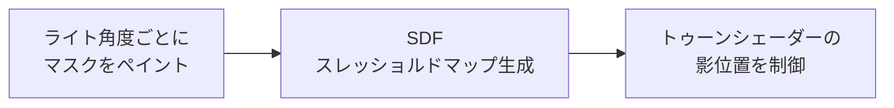

<h1 align="center">QuickSDFTool</h1>

<p align="center">
  Unreal Engine 5 上で、トゥーン影用マスクをペイントして SDF スレッショルドマップを生成するエディターモードプラグイン。
  <br>
  <a href="#デモ">デモ</a> · <a href="#クイックスタート">クイックスタート</a> · <a href="#制作向けユースケース">ユースケース</a> · <a href="./README.md">English</a>
</p>

> [!NOTE]
> **ステータス: プレビュー / ベータ。** QuickSDFTool は実験や小規模な制作検証に使える状態ですが、安定版までは API、UI、保存アセット形式が変更される可能性があります。

## デモ

QuickSDFTool は、複数のライト角度ごとに 3D メッシュ上へ二値化された明暗マスクをペイントし、それらをトゥーン/セルシェーディング用の高精度 SDF スレッショルドテクスチャへ合成します。

https://github.com/user-attachments/assets/1eb770b6-b65d-44bb-b5a0-fbb78d998202

基本ワークフローは次の通りです。



## 現在できること

- `Quick SDF` という専用 UE5 エディターモード。
- Static Mesh / Skeletal Mesh への直接ペイントと、対象マテリアルスロットの分離表示。
- UV ガイド、元シェーディングのオーバーレイ、オニオンスキンに対応した 2D UV プレビューペイント。
- サムネイル、シークバー/シークマーカー、5 度スナップ、追加/複製/削除、シンメトリー状態に応じた枚数補完、均等再配置、`DirectionalLight` 同期付きの角度タイムライン。
- ビューポート移動を抑制しながら使える左右矢印キーの前後フレーム移動。
- Current / All / Before Current / After Current のペイント対象モード。
- シンメトリーモード、ホールドで直線化するクイックストローク、全角度同時ペイント系ワークフロー、スイープ範囲に応じた 8 枚 / 15 枚の標準補完。
- 角度マスク間で明暗が複数回反転するストロークをサイレントにクリップする Monotonic Guard と、SDF 生成前の検証警告。
- Lazy Radius 系のストローク安定化、筆圧によるブラシ半径、アンチエイリアス付きブラシ境界、1K〜4K の Render Target ペイント最適化。
- 選択中テクスチャ、ファイルピッカー、タイムラインへのドラッグ&ドロップからのマスクインポート、マスクエクスポート、非破壊 `UQuickSDFAsset` 保存、Undo/Redo。
- Monopolar / Bipolar 自動判定付き CPU SDF 生成、1x-8x アップスケール、half-float テクスチャ出力。
- `Content/Materials/` にプレビュー/トゥーン用マテリアルを同梱。

## SDF スレッショルドマップとは？

一般的なトゥーン影は `N dot L` のしきい値で切りますが、これだけだと法線やメッシュ形状の影響を強く受けます。SDF スレッショルドマップは、アーティストが決めた「この角度でここまで影にする」という遷移情報を UV 空間に保存します。

```text
ペイント済み明暗マスク -> SDF 補間 -> RGBA threshold texture -> 制御しやすいトゥーン影
```

物理的に正しい影よりも、キャラデザインとして気持ちいい影を優先したい場面に向いています。

## 制作向けユースケース

- **顔影:** 頬、鼻、口元、目元の影をライト回転に合わせて破綻しにくく制御。
- **髪影:** 前髪や横髪の影を、細かい法線に頼らず整理された帯として表現。
- **服の影:** グラフィックな折り目影をトゥーンマテリアル上で安定させる。
- **小規模制作:** 外部ツールとの往復を減らし、UE エディター内で影マスクを反復。

## クイックスタート

まず結果を見るための最短手順です。

1. このリポジトリを C++ Unreal プロジェクトの `Plugins/QuickSDFTool/` にコピーします。
2. プロジェクトファイルを再生成し、ビルド後に **QuickSDFTool** を有効化してエディターを再起動します。
3. エディターモードセレクターから **Quick SDF** を選びます。
4. レベル内のメッシュを選択します。
5. `LMB` で白、`Shift + LMB` で黒/影をペイントします。
6. タイムラインキーを追加、複製、削除、移動してライト角度を設定します。
7. 必要に応じて、現在のマスクだけ、全マスク、現在より前/後の範囲へストロークを反映するペイント対象モードを選びます。
8. ツール詳細から **Create Threshold Map** または **Generate SDF Threshold Map** を実行します。
9. `/Game/QuickSDF_GENERATED/` の生成テクスチャをトゥーンマテリアルに接続します。

詳しくは [Examples](./Examples/README.md)、[Material Setup](./Docs/MaterialSetup.md)、[Troubleshooting](./Docs/Troubleshooting.md) を参照してください。

## インストール

QuickSDFTool は Unreal Engine 5.7 以降の C++ Unreal プロジェクトのみ対応です。

1. リポジトリをクローンまたはダウンロードします。

   ```bash
   git clone https://github.com/yeczrtu/QuickSDFTool.git
   ```

2. プロジェクトに配置します。

   ```text
   YourProject/
   └── Plugins/
       └── QuickSDFTool/
           ├── QuickSDFTool.uplugin
           ├── Source/
           ├── Shaders/
           └── Content/
   ```

3. プロジェクトファイルを再生成してビルドします。

   ```text
   YourProject.uproject を右クリック -> Visual Studio project files を生成 -> ビルド
   ```

4. プラグインを有効化します。

   ```text
   Edit -> Plugins -> "QuickSDFTool" を検索 -> Enable -> Restart Editor
   ```

## 互換性

| Unreal Engine version | 状態 |
| --- | --- |
| 5.7.4 | 開発・検証ターゲット |
| 5.7.x | 対応ターゲット |
| 5.8+ | 対応予定。ただしリリース検証は未完了 |
| 5.6 以前 | 非対応 |

QuickSDFTool は UE 5.7 以降のみ対応です。エディターツールは UE 5.7 開発時点の Interactive Tools Framework、Modeling Components、Material Baking、シェーダーモジュールまわりの挙動に依存しているため、UE 5.6 以前はサポート対象外です。

## 操作方法

| 入力 | アクション |
| --- | --- |
| `LMB Drag` | 白/ライトをペイント |
| `Shift + LMB Drag` | 黒/影をペイント |
| `Ctrl + F`、マウス移動、クリック | ブラシサイズ変更 |
| `Alt + T` | クイックトグルメニューを開く |
| `Alt + 1` | ペイント対象モードを切り替え |
| `Alt + 2` - `Alt + 9` | Auto Light、Preview、UV オーバーレイ、Shadow オーバーレイ、Onion Skin、Quick Stroke、Symmetry、Monotonic Guard を切り替え |
| `Left / Right Arrow` | 前/次のタイムラインフレームを選択 |
| `Timeline Track Click / Drag` | ライト角度をシークし、最も近いキーを選択 |
| `Timeline Key Click` | 角度選択 |
| `Timeline Key Drag` | 角度調整 |
| `Timeline Add / Duplicate / Delete` | キーフレームの作成、コピー、削除 |
| `Timeline Seek Bar Click / Drag` | プレビュー角度をシークし、最も近いタイムラインキーを選択 |
| `Timeline 8 または 15 / Even` | 標準枚数への補完、または角度の均等再配置。シンメトリーONでは8枚、OFFでは15枚へ補完 |
| `Texture2D` アセットをタイムラインへドラッグ | 編集済みマスクをインポート |
| `Ctrl + Z / Ctrl + Y` | Undo / Redo |

## 機能

- **カスタムエディターモード** — UE5 のモードセレクターから利用できる専用モード。
- **メッシュ直接ペイント** — 対象メッシュ表面へリアルタイムプレビュー付きでペイントし、マテリアルスロット単位の絞り込みも可能。
- **2D UV キャンバスペイント** — テクスチャ空間で細部を調整。
- **ペイント対象モード** — 現在のマスク、全マスク、またはタイムライン上の前/後範囲へストロークを反映。
- **Monotonic Guard / クリッピングマスク** — 有効時は、通常ブラシと Quick Stroke の確定時に、同じ UV ピクセルが角度マスク間で複数回反転しないようクリップします。現在マスクだけのストロークでも周辺の処理対象マスク列と比較し、戻すのはそのストロークで変更されたピクセルだけです。インポート、リベイク、SDF 生成では自動修正せず、検証警告のみを表示します。
- **ブラシフィール調整** — Lazy Radius 系のストローク安定化、細かいスタンプ間隔、アンチエイリアス付きブラシマスク、タブレット向けの筆圧ブラシ半径に対応。
- **角度タイムライン UI** — ライト角度ごとのキーフレームを、サムネイル、対応済みのシークバー、追加/複製/削除、スナップ、シンメトリー状態に応じた枚数補完、均等再配置付きで管理。
- **プレビューライトワークフロー** — モード中は既存 `DirectionalLight` を一時的にミュートし、プレビューライトで角度確認。終了時や保存時に元の強度へ戻します。
- **オリジナルシェーディングから自動フィル** — 現在のライティングを初期マスクとしてベイク。
- **マスク I/O** — 選択中アセット、画像ファイル、タイムラインドロップから編集済みマスクを取り込み、外部編集用にマスクを書き出し。
- **SDF 生成パイプライン** — SDF 補間、Monopolar / Bipolar 自動 RGBA パッキング、half-float テクスチャ出力で threshold map を生成。
- **非破壊ワークフロー** — `UQuickSDFAsset` に作業状態を保存し、必要に応じてマスクテクスチャも一緒に保存して反復可能。

## Monotonic Guard

`Monotonic Guard` は、SDF スレッショルドマスク向けの任意のペイント時安全機能です。`R >= 127` を白、それ未満を黒として扱い、処理対象の角度列内で `黒 -> 白 -> 黒` や `白 -> 黒 -> 白` のような複数回反転が生まれないようにします。

- クイックトグル上の表示名は `Guard`、ショートカットは `Alt + 9` です。
- `Clip Direction` の標準は `Auto` です。`0-90` 度では `White Expands`、`90-180` 度では `White Shrinks` として扱います。手動指定として `White Expands` / `White Shrinks` も選べます。
- 通常ブラシと Quick Stroke は、Undo 差分が確定する前にサイレントにクリップされます。ペイント操作は止めず、ブラシ中の通知も表示しません。
- アンチエイリアスされた半透明エッジもストローク意図として扱います。ピクセルが明るくなった場合は白方向、暗くなった場合は黒方向のストロークとして判定するため、`127` の二値しきい値を跨がない残りもクリップ対象になります。
- `Current / All / Before / After` は、どのマスクへストロークを書き込むかを決めます。ガードは関連する処理対象マスク列で判定し、現在のストロークで変更されたピクセルだけを開始前の状態へ戻します。
- インポート済みマスク、リベイク済みマスク、SDF 生成は自動修正しません。既存違反は `Validate Monotonic Guard` アクション、またはガード有効状態での SDF 生成時に警告として確認できます。

## ロードマップ

> [!IMPORTANT]
> ロードマップは、初めて触るアーティストが安心して試せるようにする優先度で並べています。

### P0: プレビューリリースの信頼性

- [ ] SDF 出力方向を確定し、ドキュメント化する。
- [ ] UV 依存のブラシサイズ差を改善、または明確に説明する。
- [ ] マスクペイント -> SDF テクスチャ -> トゥーンシェーダー結果の短尺動画を追加する。
- [ ] `v0.1.0-preview` をリリースし、導入確認手順を添える。

### P1: パフォーマンスと互換性

- [ ] GPU JFA SDF 経路をユーザーが使う生成フローに接続する。
- [ ] 1K、2K、4K のマスクワークフローをベンチマークする。
- [ ] 新しいエンジンバージョンに合わせて UE 5.7 以降の互換性メモを更新する。

### P2: ペイント体験の強化

- [ ] カスタムブラシアルファテクスチャをインポートする。
- [ ] ブラシプリセットと任意のブラシ減衰カーブ設定を追加する。
- [ ] キーボード操作だけでは不足する場合に備え、前後タイムライン移動の明示的なツールバーボタンを追加する。
- [ ] 未保存マスク変更の自動保存/ホットリロード復元を追加する。

### 計画中の機能要件

> [!NOTE]
> このセクションは今後実装するためのロードマップ要件です。現在のプレビュー版ではまだ利用できず、現時点の C++ API、`UQuickSDFAsset` 形式、Slate UI、ショートカット、アセット形式を変更するものではありません。

#### Quick Nose

- `Quick Nose` は、アーティストが鼻位置を1点指定するだけで、鼻影プリセットを素早く配置する非破壊ベクターレイヤーとして扱います。
- 配置後は、位置、回転、スケール、カーブ形状、制御点を編集できるようにし、プリセットは最終形ではなく素早い開始点として使います。
- ベイクは現在のマスクまたは複数マスク範囲に対応し、Undo 可能にします。元のベクターレイヤーは後から再編集できるよう保持します。

#### Quick Reshape

- `Quick Reshape` は仮称です。アーティストは1枚の非破壊UVキャンバスガイドレイヤー上に複数の `Boundary Line` カーブを描き、各線へタイムライン上の角度を `Assigned Angle` として割り当てます。
- 各境界線は、対応する角度マスクの明暗境界として扱います。`Bake Matching Angles` は、境界線に割り当てられた角度のマスクだけを生成または更新し、全タイムラインマスクを作り直しません。
- 境界線は編集可能なベクターデータとして保持し、ベイク後も位置やカーブ形状を調整して再ベイクできるようにします。
- 白/黒の塗り側は、角度と線の向きから `Auto Side` で自動推定します。必要に応じて、線ごとに `Invert Side` で反転できるようにします。
- 有効な境界線は、アクティブなUVアイランドを分割する線、または閉領域を作る線に限定します。曖昧な部分線はベイク前に警告し、塗り分けはアクティブなUVアイランド内に制限します。
- `Quick Reshape` は `Stroke Auto Fill` とは別機能として扱います。`Stroke Auto Fill` は単発線の塗り補助、`Quick Reshape` は複数角度の境界線設計図からマスクを作るワークフローです。
- `Monotonic Guard` と併用できるようにし、ベイク時またはベイク後に `黒 -> 白 -> 黒` / `白 -> 黒 -> 白` の反転破綻を検出できる要件にします。

#### Brush Projection Mode

- `Brush Projection Mode` は、現在のサーフェス/UV基準のペイントに加えて、最終的な画面上の見た目を基準に塗りたいアーティスト向けの切り替えオプションです。
- 初期実装では意図的に選択肢を絞ります。`Surface / UV` は現在の精密なテクスチャ空間ワークフローを維持し、`View Projected` は画面上のブラシ形状をそのまま表示して、見えているメッシュ表面へ投影します。
- `View Projected` は、顔影の形を素早く作る場面で、UV上のブラシ形状よりビューポート上のシルエットを優先したいときに使う Blender/Substance 風のカメラ投影ペイントとして扱います。
- 最初から投影方向、整列、サイズ空間などを細かく増やしすぎず、QuickSDFTool らしい素早いモード切り替えに留めます。
- 投影ブラシは標準では見えているヒット面だけに作用し、背面や遮蔽された面へ意図せず塗らないよう、バックフェース/オクルージョン保護を持たせます。
- ブラシ半径、フォールオフ、アンチエイリアス、筆圧半径、Quick Stroke、ペイント対象モードなど既存のブラシ操作は、可能な範囲で両方の投影モードに対応します。
- 同じストロークでもモードによってUV上の結果が変わるため、ビューポートカーソルで現在の投影モードが分かるようにします。

#### Timeline Status Badges

- 既存のサムネイルタイムラインに、`Current / All / Before / After` の対象範囲を帯やハイライトで表示します。
- 各キーには、マスク有無、`Monotonic Guard` 有効状態、未ベイクのベクターレイヤー、警告状態を示す小さなバッジを表示します。
- ツールチップでは、角度、テクスチャ名、編集状態、警告内容を確認できるようにします。

#### Actor Mesh Component Selection

- 単一アクターが複数のメッシュコンポーネントを持つ場合に、QuickSDFTool の編集対象メッシュを明確に選択できない現在の制限を解消します。
- 選択中アクター内の対象候補として、`StaticMeshComponent` と `SkeletalMeshComponent` をコンポーネント単位で選べるターゲットピッカーを追加します。
- ピッカーでは、コンポーネント名、メッシュアセット名、マテリアルスロット、表示状態など、対象を判別できる情報を表示します。
- ペイント、マスクインポート、マスクエクスポート、ベイク、SDF 生成、マテリアルスロット分離は、アクター内の全メッシュではなく、選択されたメッシュコンポーネントだけに適用します。
- メッシュコンポーネントを切り替えても、それぞれの QuickSDF アセット/マスク状態を保持し、顔、髪、服、アクセサリなどを1つのアクター内で個別に編集できるようにします。
- ビューポートピックに対応する場合は、複数メッシュアクター上のサーフェスクリックから可能な限りヒットしたメッシュコンポーネントを特定し、曖昧な場合はコンポーネントピッカーにフォールバックします。

#### Mask Freeze

- `Mask Freeze` は、編集中ではないマスクのペイント用 Render Target を解放し、VRAM 使用量を抑えるワークフローです。
- フリーズ済みマスクは、作成済みのマスク内容をアセット側のデータ、または CPU/ディスク側に保存されたテクスチャデータとして保持します。一方で、一時的な `PaintRenderTarget` は、編集やプレビューで必要になるまで破棄できるようにします。
- フリーズ解除では、保存済みマスクデータから Render Target を再作成し、見た目を変えずに通常のペイント状態へ戻します。
- 現在のマスクをフリーズ、非アクティブな全マスクをフリーズ、現在のマスクをフリーズ解除、全マスクをフリーズ解除する操作を用意します。
- `All / Before / After`、一括塗り、Quick Reshape のベイク、将来的な複数マスク書き込み操作などでフリーズ済みマスクが編集対象に含まれる場合は、対象マスクを自動でフリーズ解除します。
- タイムラインキーにはフリーズ/未フリーズ状態を示すバッジを表示し、すぐ編集できるマスクと復元が必要なマスクを判別できるようにします。
- SDF 生成、エクスポート、保存、Overwrite Source 系の処理では、フリーズ済みマスクを透過的にフリーズ解除するか、保存済みデータを読み取ることで、出力からマスクが欠落しないようにします。
- Freeze/Thaw をまたいでも Undo/Redo でマスク内容が失われないようにします。

#### Stroke Auto Fill

- `Stroke Auto Fill` は、線を引いたあとに左右どちら側、または内側/外側のどちらを塗るかをプレビューして自動塗りつぶしする機能です。
- 現在のマスクだけの編集と、`All / Before / After` による一括適用の両方に対応します。
- 意図しない別アイランドへの塗り漏れやはみ出しを避けるため、塗りつぶしはアクティブな UV アイランド単位に制限します。
- 確定前にプレビューを表示し、確定後の結果は Undo できるようにします。

#### 受け入れシナリオ

- `Quick Nose` は、鼻位置指定、プリセット配置、ベクター微調整、ベイク、Undo の流れを確認します。
- `Quick Reshape` は、1枚のガイドレイヤーに `0 / 30 / 60 / 90` 度など複数の境界線を描き、対応する角度マスクだけを更新し、ベイク後もガイドレイヤーを編集でき、UVアイランドを分割しない線や閉領域を作らない線では警告されることを確認します。
- `Brush Projection Mode` は、現在の `Surface / UV` 方式と `View Projected` ブラシを切り替えられ、画面上のブラシ形状を保ったまま塗れ、隠れた面や背面へ意図せずペイントしないことを確認します。
- `Actor Mesh Component Selection` は、複数のメッシュコンポーネントを持つ単一アクターから1つの対象コンポーネントを選択でき、選択したコンポーネントだけをペイント/ベイクし、コンポーネント切り替え時にも個別の QuickSDF 状態が保持されることを確認します。
- `Mask Freeze` は、高解像度かつ複数マスクの構成で VRAM 使用量を下げ、フリーズ済みマスクを見た目の変化なく復元でき、複数マスク編集の前に対象マスクがすべて自動でフリーズ解除されることを確認します。
- `Stroke Auto Fill` は、現在マスクのみ、`Before / After / All`、UV アイランド分離、左右または内外の塗り選択を確認します。
- 英日 README の機能名、優先度、未実装ステータスが同期していることを確認します。

## 仕組み

1. **ペイント** — ライト角度ごとにメッシュまたは UV プレビューへ二値マスクを描きます。
2. **SDF** — 各マスクを符号付き距離場に変換します。
3. **補間** — 隣接マスク間の遷移を探し、しきい値 `T` を求めます。
4. **合成** — Monopolar / Bipolar 出力を自動判定し、値を RGBA チャンネルへ格納します。
   - **Monopolar:** 対称影向け。RGB に同じしきい値を格納。
   - **Bipolar:** 非対称影向け。侵入/退出値を RGBA に分けて格納。
5. **出力** — 最終 threshold map を 16-bit half-float テクスチャとして保存します。

## GitHub 公開チェックリスト

メンテナー向け:

- Topics に `unreal-engine`, `ue5`, `toon-shading`, `cel-shading`, `sdf`, `editor-plugin`, `technical-art` を追加。
- `.github/assets/social-preview.svg` を GitHub Social Preview に設定、または PNG に書き出して設定。
- [リリースノート](./Docs/ReleaseNotes/v0.1.0-preview.md) を使って `v0.1.0-preview` を作成。

## 既知の不具合

- UV レイアウトによって、ブラシサイズと実際のペイント範囲が一致しない場合があります。
- SDF 出力方向はプレビューマテリアルと照合して最終確認が必要です。
- GPU JFA シェーダーは存在しますが、公開生成フローは現在 CPU `FSDFProcessor` 経路です。

## コントリビューション

ドキュメント、UE バージョン検証、小さなワークフロー修正、サンプル追加は特に歓迎です。

## 謝辞

- [Unreal Engine Interactive Tools Framework](https://docs.unrealengine.com/5.0/en-US/interactive-tools-framework-in-unreal-engine/) — エディターペイントワークフローの基盤。
- Felzenszwalb & Huttenlocher — *Distance Transforms of Sampled Functions* (2012)。
- Jump Flooding Algorithm (JFA) — GPU 距離場生成の参考。
- [UE5 SDF Face Shadowマッピングでアニメ顔用の影を作ろう](https://unrealengine.hatenablog.com/entry/2024/02/28/222220)。
- [SDF TextureとLiltoonでセルルックの影を再現しよう！](https://note.com/ca__mocha/n/n9289fbbc4c8b)。
