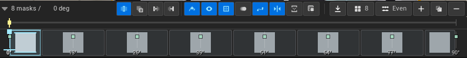

<!--
投稿用メタ情報
title: UE5でトゥーン影用SDFスレッショルドマップを作るEditor Modeプラグイン QuickSDFTool を公開しました
topics: UnrealEngine, UE5, toonshading, SDF, TechnicalArt
type: tech
公開前チェック:
- 画像パスを投稿先に合わせて差し替える
- GitHub Release URL が v1.0.1 を指していることを確認する
- スクリーンショット内キャラクターモデルのクレジットを残す
-->

# UE5でトゥーン影用SDFスレッショルドマップを作るEditor Modeプラグイン QuickSDFTool を公開しました

Unreal Engine 5 向けの Editor Mode プラグイン **QuickSDFTool** を v1.0 として公開しました。

QuickSDFTool は、トゥーン / セル調レンダリング向けに、メッシュ上へ明暗マスクをペイントし、それを **SDF threshold texture** として生成するためのツールです。

- GitHub: https://github.com/yeczrtu/QuickSDFTool
- Release v1.0.1: https://github.com/yeczrtu/QuickSDFTool/releases/tag/v1.0.1
- Documentation: https://github.com/yeczrtu/QuickSDFTool/tree/main/docs

## なぜ作ったか

トゥーン影は、よく `N dot L` のしきい値で明暗を切り替えます。

この方法はシンプルですが、キャラクターの顔や髪のように「アニメ的に気持ちいい影」を作りたい場合、法線やメッシュトポロジーの影響を強く受けます。

たとえば顔影では、頬、鼻、口元、目元の影が少しずれるだけで印象が大きく変わります。物理的には正しい影でも、キャラクターデザインとしては欲しい形にならないことがあります。

そこで QuickSDFTool では、ライト角度ごとの明暗マスクをアーティストが直接ペイントし、その遷移を UV 空間の SDF threshold texture として保存します。

概念的には次の流れです。

```text
角度ごとの明暗マスクをペイント
  -> SDF補間
  -> RGBA threshold texture
  -> トゥーンシェーダーで影位置を制御
```

## QuickSDFToolとは

QuickSDFTool は、UE の Editor Mode として動作するプラグインです。

エディター上で対象メッシュを選び、material slot ごとにマスクをペイントし、複数ライト角度のマスクから SDF threshold map を生成します。


Select mode では、メッシュ全体を表示したまま target mesh と material slot を選べます。選択中の material slot は、左側の Material Slots 行と、ビューポート上の cyan overlay で確認できます。

## 基本ワークフロー

大まかな使い方は次の通りです。

1. UE の Editor Mode から **Quick SDF** に入る
2. Select mode で編集したい mesh / material surface をクリックする
3. **Material Slots** で active slot を確認する
4. **Start Paint** で Paint mode に入る
5. `LMB` で白、`Shift + LMB` で黒 / 影をペイントする
6. Timeline でライト角度を切り替えながらマスクを作る
7. **Generate Selected SDF** または **Generate SDF Threshold Map** で texture を生成する
8. 生成された texture を toon material で使う

Paint mode では Screen projection を標準にしています。現在のカメラから見たまま、顔や髪の影を直接置けるため、キャラクター向けの影作成では扱いやすいです。


Timeline は、ライト角度の seek と keyframe 操作を分けています。キーフレームをドラッグすると seek cursor と preview light も同期するため、どの角度のマスクを編集しているかを追いやすくしています。



生成結果は SDF threshold texture として出力されます。


## v1.0 / v1.0.1で整えたUX

最初のプレビュー版から、特に「モードに入った直後の体験」と「どこを編集しているかの分かりやすさ」を重視して改善しました。

### Select / prepから始める

以前はモードに入るとすぐ Paint tool が開始され、material slot isolation によってメッシュの一部が突然非表示になることがありました。

v1.0 では、まず Select mode から始めます。対象メッシュと material slot を確認してから Paint に入るため、Substance Painter のように「まず対象を確認してから編集する」流れに近づけています。

### active slotをビューポートで見えるようにする

Material Slots の行だけでは、現在どの material slot を選んでいるかがビューポート上で分かりにくくなります。

そこで Select mode では、選択中 slot に半透明 cyan overlay を出しています。黄色アウトラインは UE の target mesh selection、cyan overlay は active material slot selection という役割分担です。

### ビューポートクリックでmeshとslotを同時選択

Select mode では、ビューポート上の面をクリックすると target mesh と material slot を同時に選択します。

UI の Material Slots リストは残しており、直接選択の確認や誤選択の補正に使えます。

### Screen modeとF focus

v1.0.1 では Screen mode を既定にし、マルチディスプレイ / DPI scale の違いによる brush preview と cursor のズレを修正しました。

また、Paint mode 中に `F` を押すと、メッシュ全体ではなく現在の brush hit へフォーカスできるようにしています。ブラシ位置が無効な場合は UE 標準の selection focus にフォールバックします。

## 導入方法

QuickSDFTool v1.0.x は Unreal Engine 5.7.x 向けです。C++ Unreal project に plugin として配置して使います。

```bash
git clone https://github.com/yeczrtu/QuickSDFTool.git
```

配置先は次の形です。

```text
YourProject/
|-- Plugins/
    |-- QuickSDFTool/
        |-- QuickSDFTool.uplugin
        |-- Source/
        |-- Shaders/
        |-- Content/
```

その後、プロジェクトファイルを再生成し、プロジェクトをビルドして **QuickSDFTool** を有効化し、エディターを再起動します。

## 互換性について

v1.0.x の対象は UE 5.7.x です。リリース検証ターゲットは UE 5.7.4 です。

| Unreal Engine version | ステータス |
| --- | --- |
| 5.7.4 | リリース検証ターゲット |
| 5.7.x | v1.0.x のサポート対象 |
| 5.8+ | 対応予定、ただし未検証 |
| 5.6 以前 | 非対応 |

GitHub Release には Win64 のビルド済み plugin zip も置いていますが、これは現在のカスタム UE 5.7 系エディターでビルドしたものです。Epic Games Launcher 版 Unreal Engine 向けの互換バイナリとしては表記していません。

Launcher 版 UE で使う場合は、ソースから使用中のエンジンビルドに合わせて再ビルドしてください。

## 詳しいドキュメント

- README: https://github.com/yeczrtu/QuickSDFTool#readme
- Workflow: https://github.com/yeczrtu/QuickSDFTool/blob/main/docs/ja/workflow.md
- Material Setup: https://github.com/yeczrtu/QuickSDFTool/blob/main/docs/material-setup.md
- Troubleshooting: https://github.com/yeczrtu/QuickSDFTool/blob/main/docs/troubleshooting.md
- Release v1.0.1: https://github.com/yeczrtu/QuickSDFTool/releases/tag/v1.0.1

## 今後

v1.0 では、まず基本的な authoring workflow を安定させることを優先しました。

今後は、UV density による brush size 差の改善、GPU JFA SDF 経路、custom brush alpha、複数 mesh component を持つ actor 向けの target picker などを検討しています。

ロードマップは以下にまとめています。

https://github.com/yeczrtu/QuickSDFTool/blob/main/docs/ja/roadmap.md

## クレジット

スクリーンショット内のキャラクターモデル:

- [真冬 Mafuyu / オリジナル3Dモデル](https://booth.pm/ja/items/5007531)
- ショップ: ぷらすわん
- キャラクターデザイン / 3Dモデリング: 有坂みと

## おわりに

QuickSDFTool は、トゥーン影の形を「法線任せ」ではなく、アーティストが直接制御するための UE Editor Mode プラグインです。

キャラクターの顔影、髪影、服のグラフィックな影など、物理的な正しさよりも絵としての気持ちよさを優先したい場面で役に立つはずです。

興味があれば、ぜひ試してみてください。
