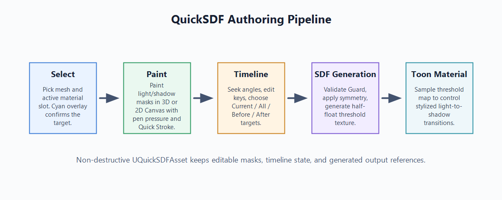
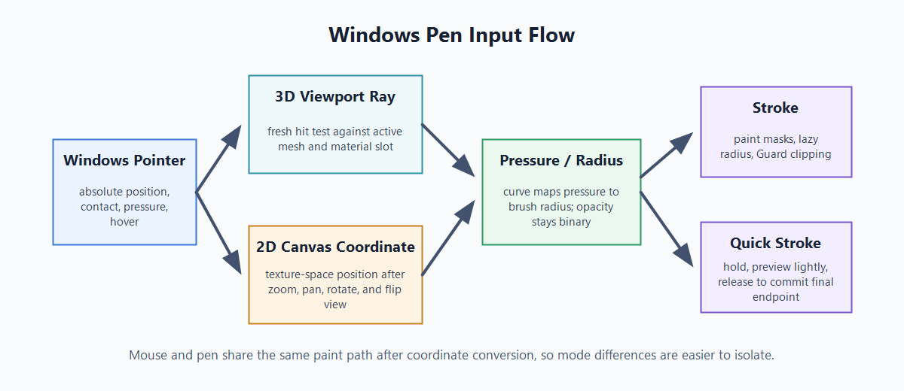
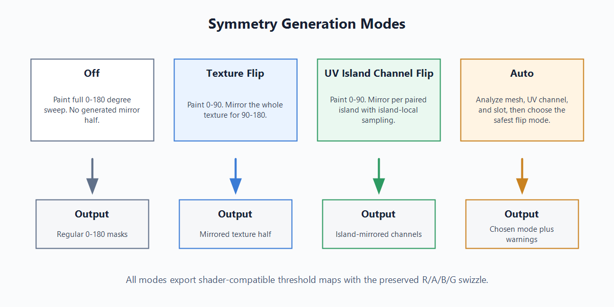
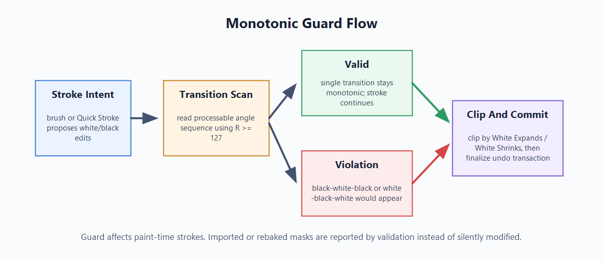

<!--
投稿用メタ情報
title: UE5 でトゥーン影用 SDF スレッショルドマップを作る Editor Mode プラグイン QuickSDFTool を公開しました
topics: UnrealEngine, UE5, toonshading, SDF, TechnicalArt
type: tech
公開前チェック:
- 画像パスを投稿先に合わせて差し替える
- GitHub Release URL が v1.0.1 を指していることを確認する
- スクリーンショット内キャラクターモデルのクレジットを残す
-->

# UE5 でトゥーン影用 SDF スレッショルドマップを作る Editor Mode プラグイン QuickSDFTool を公開しました

Unreal Engine 5 向けの Editor Mode プラグイン **QuickSDFTool** を v1.0 系として公開しました。

QuickSDFTool は、トゥーン / セル調レンダリング向けに、メッシュ上へライト角度ごとの白黒マスクをペイントし、それを **SDF threshold texture** として生成するためのツールです。

- GitHub: https://github.com/yeczrtu/QuickSDFTool
- Release v1.0.1: https://github.com/yeczrtu/QuickSDFTool/releases/tag/v1.0.1
- Documentation: https://github.com/yeczrtu/QuickSDFTool/tree/main/docs

## 何を作ったか

トゥーン影では、よく `N dot L` のしきい値で明暗を切り替えます。

この方法はシンプルですが、キャラクターの顔や髪のように「物理的な影」よりも「絵として気持ちいい影」を作りたい場合、法線やメッシュトポロジーの影響を強く受けます。

QuickSDFTool では、ライト角度ごとの明暗マスクをアーティストが直接ペイントし、その遷移を SDF threshold texture として保存します。

概念的には次の流れです。

```text
角度ごとの明暗マスクをペイント
  -> SDF 補間
  -> RGBA threshold texture
  -> toon shader で影位置を制御
```



## QuickSDFTool とは

QuickSDFTool は UE の Editor Mode として動作するプラグインです。

Editor 上で対象メッシュを選び、material slot ごとにマスクをペイントし、複数ライト角度のマスクから SDF threshold map を生成します。


Select mode では、メッシュ全体を表示したまま target mesh と material slot を選べます。選択中の material slot は Material Slots 行と viewport 上の cyan overlay で確認できます。

## 基本ワークフロー

大まかな使い方は次の通りです。

1. UE の Editor Mode から **Quick SDF** に入る。
2. Select mode で編集したい mesh / material surface をクリックする。
3. **Material Slots** で active slot を確認する。
4. **Start Paint** で Paint mode に入る。
5. `LMB` で白、`Shift + LMB` で黒 / 影をペイントする。
6. 2D Canvas が必要なら、texture-space で UV overlay や onion skin を見ながら補正する。
7. Quick Stroke が必要なら、stroke を hold して直線 preview を動かし、release 位置で確定する。
8. Timeline でライト角度を切り替えながらマスクを作る。
9. **Generate Selected SDF** または **Generate SDF Threshold Map** で texture を生成する。
10. 生成された texture を toon material で使う。

Paint mode の標準は Screen projection です。現在のカメラから見たまま、顔や髪の影を直接置けるため、キャラクター向けの影作成で扱いやすいです。


Timeline は、ライト角度の seek と keyframe 操作を分けています。keyframe を drag すると seek cursor と preview light も同期するため、どの角度のマスクを編集しているかを追いやすくしています。


生成結果は SDF threshold texture として出力されます。


## 2D Canvas とペン入力

2D Canvas は texture-space で細かく修正したい場合に使います。

- Texture Set / Angle selector。
- brush size と `Ctrl + F` brush resize。
- Fit / 100% zoom。
- rotate / flip view。
- checker / grid。
- UV overlay。
- onion skin。
- Windows pen-display / tablet input。

Windows pen input は 3D Paint と 2D Canvas の両方で扱います。hover、stroke start、drag、release、pressure radius、Quick Stroke、`Ctrl + F` brush resize が、window 移動や resize 後も pointer position と合うことを重視しています。



## Quick Stroke

Quick Stroke は、stroke を一定時間 hold して直線 preview に切り替え、release 位置で確定する workflow です。

移動中の preview update は軽量化されるため、pen tablet の高頻度入力でも毎 frame 重い stroke work を走らせないようにしています。最終的な stroke は release 時の endpoint で確定します。

## Symmetry と Monotonic Guard

SDF generation では、通常の 0-180 painting に加えて `Texture Flip`、`UV Island Channel Flip`、`Auto` を選べます。



`Monotonic Guard` は、角度列の中で `black -> white -> black` のような繰り返し transition が生まれないように、paint-time に stroke を clip する safety check です。



## 導入方法

QuickSDFTool v1.0.x は Unreal Engine 5.7.x 向けです。C++ Unreal project に plugin として配置して使います。

```bash
git clone https://github.com/yeczrtu/QuickSDFTool.git
```

配置先は次の形です。

```text
YourProject/
|-- Plugins/
    |-- QuickSDFTool/
        |-- QuickSDFTool.uplugin
        |-- Source/
        |-- Shaders/
        |-- Content/
```

その後、project files を再生成し、プロジェクトをビルドして **QuickSDFTool** を有効化し、エディターを再起動します。

## 互換性について

v1.0.x の対象は UE 5.7.x です。リリース検証ターゲットは UE 5.7.4 です。

| Unreal Engine version | ステータス |
| --- | --- |
| 5.7.4 | リリース検証ターゲット |
| 5.7.x | v1.0.x のサポート対象 |
| 5.8+ | 対応予定、ただし未検証 |
| 5.6 以前 | 非対応 |

GitHub Release には Win64 のビルド済み plugin zip を置いています。v1.0.1 の `QuickSDFTool-v1.0.1-UE57Launcher-Win64.zip` は Epic Games Launcher 版 Unreal Engine 5.7.4 でビルドしたものです。

Launcher 版 UE 5.7.x project ではこの zip を利用できます。source-built、licensee、custom、または異なる engine build で使う場合は、source から使用中の engine build に合わせて再ビルドしてください。

## 詳しいドキュメント

- README: https://github.com/yeczrtu/QuickSDFTool#readme
- Workflow: https://github.com/yeczrtu/QuickSDFTool/blob/main/docs/ja/workflow.md
- Material Setup: https://github.com/yeczrtu/QuickSDFTool/blob/main/docs/material-setup.md
- Troubleshooting: https://github.com/yeczrtu/QuickSDFTool/blob/main/docs/troubleshooting.md
- Release v1.0.1: https://github.com/yeczrtu/QuickSDFTool/releases/tag/v1.0.1

## 今後

v1.0 では、まず基本的な authoring workflow を安定させることを優先しました。

今後は UV density による brush size 差の改善、GPU JFA final generation の評価、custom brush alpha、Quick Nose / Quick Reshape などの higher-level authoring workflow を検討しています。

Roadmap は以下にまとめています。

https://github.com/yeczrtu/QuickSDFTool/blob/main/docs/ja/roadmap.md

## クレジット

スクリーンショット内のキャラクターモデル:

- [真冬 Mafuyu / オリジナル3Dモデル](https://booth.pm/ja/items/5007531)
- ショップ: ぷらすわん
- キャラクターデザイン / 3Dモデリング: 有坂みと

## おわりに

QuickSDFTool は、トゥーン影の形を「法線任せ」ではなく、アーティストが直接制御するための UE Editor Mode プラグインです。

キャラクターの顔影、髪影、服のグラフィックな影など、物理的な正しさよりも絵としての気持ちよさを優先したい場面で役に立つはずです。
